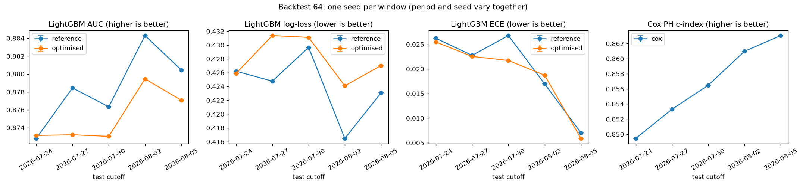

# Backtest (walk-forward), brandId 64

The training, validation and test periods move forward 3 days at a time: each scenario trains on the previous 2 cutoffs (train / validation split by player) and tests on the next one. Three models per scenario, trained exactly as in normal training: the **reference** LightGBM (optimisation step 1), the **optimised** LightGBM (every optimisation step) and Cox PH (with the optimised LightGBM's features). Seed mode **per_window**: each window has its own random seed (892, 4330, 4388, 6545, 7739); the seed changes the train / validation split, the LightGBM row and column sampling and the Optuna search. This is the temporal robustness check of the training spec (point 8).

Backtest id `backtest_brand64_2026-10-06_step3_1791353580` (data as of 2026-10-06, 5 scenarios x 5 seeds = 5 trainings per model, 13.9 min). Every run is in MLflow with the tags `backtest_id`, `scenario` and `seed`; the summary run (experiment `whizdom-churn-backtest`) has one chart per metric across scenarios.

## Results per scenario (test month; mean ± spread between seeds)

| # | test | test rows | churn | AUC ref | AUC opt | log-loss ref | log-loss opt | ECE ref | ECE opt | C-index |
|---|---|---|---|---|---|---|---|---|---|---|
| 1 | 2026-07-24 | 13,512 | 38.0% | 0.8728 | 0.8731 | 0.4262 | 0.4259 | 0.0262 | 0.0255 | 0.8495 |
| 2 | 2026-07-27 | 14,163 | 40.2% | 0.8784 | 0.8732 | 0.4248 | 0.4314 | 0.0228 | 0.0225 | 0.8533 |
| 3 | 2026-07-30 | 14,464 | 41.3% | 0.8763 | 0.8730 | 0.4297 | 0.4311 | 0.0268 | 0.0217 | 0.8565 |
| 4 | 2026-08-02 | 14,685 | 42.5% | 0.8843 | 0.8795 | 0.4165 | 0.4241 | 0.0170 | 0.0187 | 0.8610 |
| 5 | 2026-08-05 | 14,687 | 42.8% | 0.8805 | 0.8771 | 0.4231 | 0.4270 | 0.0070 | 0.0059 | 0.8631 |

## Summary

Mean over the windows and its standard deviation. Each window has its own seed, so this spread mixes the change of period and the change of seed: if it is small, the model is robust to both. To tell them apart, run with `SEED_MODE=grid`.

| Metric | Reference: mean / ± between windows (period and seed) | Optimised: mean / ± between windows (period and seed) |
|---|---|---|
| LightGBM AUC | 0.8785 / ± 0.0043 | 0.8752 / ± 0.0029 |
| LightGBM log-loss | 0.4240 / ± 0.0049 | 0.4279 / ± 0.0032 |
| LightGBM ECE | 0.0200 / ± 0.0082 | 0.0189 / ± 0.0076 |
| Cox PH c-index | | 0.8567 / ± 0.0055 |

**Does the optimisation gain hold on every scenario?** No: averaged over the seeds, the optimised model has a higher or equal AUC in 1 of 5 scenarios (mean change -0.0033) and a lower or equal log-loss in 1 of 5 (mean change +0.0039). By the spec's rule (point 8), the simpler reference configuration is the safer choice until the gain holds on every scenario.

## How to read it

- A difference between two models smaller than the spread between seeds is luck, not a real difference; one smaller than the spread between periods may not hold next month.
- The scenarios are **not independent**: the 60-day label windows of nearby cutoffs overlap and the players repeat, so the results look more stable than they would be on truly separate periods. A fully out-of-time test needs training cutoffs at least 60 days before the test cutoff, which the history does not allow yet. Each new week of data adds a cutoff, so this backtest gains weight with time.
- The winsorisation caps come from the configuration of the main pipeline (they may have seen some test cutoffs' features, not their labels).

Generated by `src/models/backtest.py` (`make backtest`). Table (one row per scenario and seed): `data/03_output/backtest/backtest_brand64_2026-10-06_step3_1791353580.csv`.
