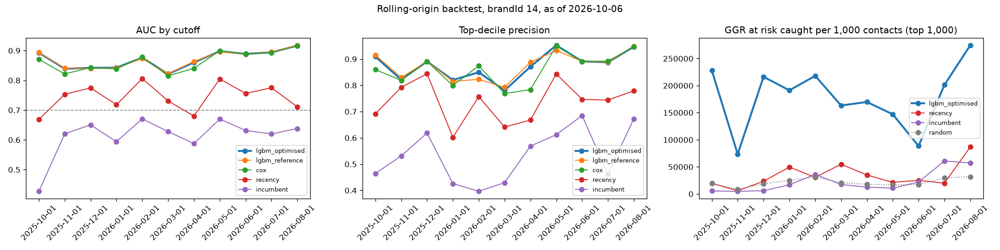

# Backtest v0: rolling-origin (brandId 14)

Does the model predict the way it will be used: trained on the past, scored on a date, judged on what the players did next, repeated over a year. Backtest id `backtest_brand14_2026-10-06_1791539629`, data as of 2026-10-06, 11 test cutoffs, 36 min. Config: `configs/backtest.yaml`.

**Verdict: FAIL** (a model that fails is not promoted, whatever its single-split scores).

| Pass condition (delivery plan) | Candidate (`lgbm_optimised`) | Result |
|---|---|---|
| mean top-decile precision >= 1.10x the recency rule | 0.875 vs 0.737: 1.19x [1.13, 1.25] | pass |
| AUC never below 0.7 | min 0.821 (2026-03-01) | pass |
| ECE never above 0.08 | max 0.112 (2026-05-01) | FAIL |

## How It Runs

- **Test cutoffs**: the first day of each month, 2025-10-01, 2025-11-01, 2025-12-01, 2026-01-01, 2026-02-01, 2026-03-01, 2026-04-01, 2026-05-01, 2026-06-01, 2026-07-01, 2026-08-01. Skipped (fewer than 2 earlier months with a known label): 2025-09-01.
- **Training at each cutoff C**: every earlier monthly cutoff whose 60-day label was already known on C (cutoff + 60 days <= C), labels computed from data up to C only; the latest 1 of them are the validation months (early stopping, tuning, calibration). So the training data grows from 2 to 12 months, and the models never see a label C did not know.
- **Scored**: every player with a bet in the 30 days up to C, judged on the 60 days after it (data up to 2026-10-06).
- **Calibration level on C**, as scoring sets it (`src/models/calibration_level.py`): one log-odds shift per brand, the median of the shifts that set the mean probability right on the last 3 months with a known label and on the later months' early signal (who has bet again by C). It changes no ranking, only the ECE, log-loss and Brier; the ECE without it is in the per-cutoff table.
- **Models**: trained exactly as in normal training, with 20 Optuna trials (not 100) and at most 500 trees, as the plan allows for the backtest. Each training run is in MLflow with the tag `backtest_id`.
- **Comparators**: `lgbm_reference` (optimisation step 1), `cox` (partial hazard), `recency` (days since the last bet alone) and `incumbent` (the platform's `churn_score` in `gld_player_signals_daily`, a weighted heuristic: 0.5 recency + 0.3 frequency + 0.2 value). The plan's 7/14/30-day labels are replaced by the 60-day churn of `docs/churn_definition_v0.md`.

## Results Across Cutoffs

Mean, 95% bootstrap CI of the mean (cutoffs resampled, 200 times) and range. Log-loss, ECE and Brier only for the calibrated probabilities.

| comparator | auc | c_index | top_decile_precision | top_decile_recall | log_loss | ece | brier |
|---|---|---|---|---|---|---|---|
| cox | 0.864 [0.845, 0.884] (range 0.815 to 0.915) | 0.839 [0.817, 0.859] (range 0.792 to 0.910) | 0.862 [0.827, 0.896] (range 0.769 to 0.950) | 0.155 [0.142, 0.169] (range 0.125 to 0.196) | n/a | n/a | n/a |
| incumbent | 0.612 [0.574, 0.645] (range 0.427 to 0.671) | 0.603 [0.570, 0.627] (range 0.450 to 0.654) | 0.534 [0.468, 0.591] (range 0.397 to 0.685) | 0.095 [0.088, 0.104] (range 0.079 to 0.120) | n/a | n/a | n/a |
| lgbm_optimised | 0.870 [0.853, 0.889] (range 0.821 to 0.917) | 0.844 [0.825, 0.863] (range 0.797 to 0.911) | 0.875 [0.841, 0.901] (range 0.780 to 0.953) | 0.157 [0.146, 0.170] (range 0.136 to 0.195) | 0.427 [0.401, 0.450] (range 0.354 to 0.506) | 0.054 [0.037, 0.070] (range 0.014 to 0.112) | 0.135 [0.125, 0.145] (range 0.108 to 0.167) |
| lgbm_reference | 0.870 [0.854, 0.888] (range 0.822 to 0.918) | 0.843 [0.825, 0.862] (range 0.797 to 0.913) | 0.874 [0.846, 0.900] (range 0.793 to 0.948) | 0.157 [0.147, 0.169] (range 0.136 to 0.195) | 0.427 [0.401, 0.450] (range 0.351 to 0.503) | 0.055 [0.038, 0.070] (range 0.018 to 0.114) | 0.135 [0.125, 0.145] (range 0.108 to 0.166) |
| recency | 0.743 [0.718, 0.772] (range 0.669 to 0.806) | 0.724 [0.702, 0.745] (range 0.657 to 0.782) | 0.737 [0.697, 0.776] (range 0.602 to 0.844) | 0.132 [0.123, 0.143] (range 0.106 to 0.164) | n/a | n/a | n/a |

## AUC per Cutoff

| cutoff | n_players | churn_rate | n_train_cutoffs | lgbm_optimised | lgbm_reference | cox | recency | incumbent | ECE lgbm_optimised | ECE without level | level shift |
|---|---|---|---|---|---|---|---|---|---|---|---|
| 2025-10-01 | 14849 | 0.591 | 2 | 0.893 | 0.893 | 0.870 | 0.669 | 0.427 | 0.065 | 0.065 | -0.002 |
| 2025-11-01 | 15810 | 0.580 | 3 | 0.839 | 0.841 | 0.822 | 0.753 | 0.620 | 0.022 | 0.023 | 0.029 |
| 2025-12-01 | 17699 | 0.653 | 4 | 0.842 | 0.840 | 0.843 | 0.775 | 0.651 | 0.094 | 0.058 | -0.342 |
| 2026-01-01 | 10564 | 0.497 | 5 | 0.843 | 0.841 | 0.838 | 0.718 | 0.594 | 0.045 | 0.043 | 0.134 |
| 2026-02-01 | 8525 | 0.461 | 6 | 0.876 | 0.873 | 0.879 | 0.806 | 0.671 | 0.043 | 0.052 | -0.165 |
| 2026-03-01 | 11293 | 0.505 | 6 | 0.821 | 0.822 | 0.815 | 0.731 | 0.628 | 0.053 | 0.098 | -0.436 |
| 2026-04-01 | 13727 | 0.628 | 7 | 0.860 | 0.863 | 0.840 | 0.680 | 0.587 | 0.071 | 0.071 | -0.001 |
| 2026-05-01 | 14753 | 0.685 | 9 | 0.898 | 0.896 | 0.900 | 0.805 | 0.670 | 0.112 | 0.132 | 0.119 |
| 2026-06-01 | 10857 | 0.573 | 10 | 0.889 | 0.889 | 0.889 | 0.756 | 0.632 | 0.043 | 0.039 | -0.037 |
| 2026-07-01 | 8360 | 0.456 | 11 | 0.894 | 0.895 | 0.893 | 0.775 | 0.620 | 0.035 | 0.050 | -0.480 |
| 2026-08-01 | 10535 | 0.563 | 12 | 0.917 | 0.918 | 0.915 | 0.711 | 0.638 | 0.014 | 0.014 | -0.028 |

## Targeting Replay (would it have paid?)

A campaign that contacts the top **1,000** players at every cutoff (N to agree with the CRM team). The candidate ranks by **value at risk** = trailing-90-day mean daily GGR x 30 x its churn probability; `recency` and `incumbent` rank by their own score; `random` is the expected value of a random pick. **Realised GGR at risk** = the 30-day value of the players who did churn. No treatment was applied, so this measures targeting quality, not uplift.

| ranking | churn_captured | ggr_at_risk_captured | ggr_at_risk_per_1000 |
|---|---|---|---|
| incumbent | 0.081 [0.063, 0.100] (range 0.044 to 0.130) | 0.089 [0.052, 0.132] (range 0.018 to 0.245) | 22,766.258 [12,511.299, 34,925.379] (range 4,888.506 to 60,846.942) |
| lgbm_optimised | 0.036 [0.026, 0.049] (range 0.014 to 0.076) | 0.692 [0.630, 0.744] (range 0.474 to 0.820) | 179,227.210 [141,978.451, 207,425.612] (range 73,489.012 to 274,499.074) |
| random | 0.085 [0.074, 0.097] (range 0.057 to 0.120) | 0.085 [0.074, 0.097] (range 0.057 to 0.120) | 21,582.550 [17,142.777, 25,449.421] (range 8,253.770 to 31,788.822) |
| recency | 0.114 [0.091, 0.141] (range 0.073 to 0.194) | 0.129 [0.084, 0.176] (range 0.045 to 0.259) | 33,861.067 [22,284.034, 51,443.864] (range 5,841.143 to 86,810.755) |

## How to Read It

- **Top-decile condition at 1.10x, not the plan's 1.5x** (`docs/decision_top_decile_condition.md`): precision cannot exceed 1 and the recency rule already reaches 0.737, so the most any model could reach is 1.36x, and this ceiling falls in the months with more churn. 1.10x is the strictest round value the model meets with 95% confidence in brands 14, 64 and 73, and at today's precisions it is the plan's own demand (1.5 times the churners found per wasted contact). Interval: 95%, cutoffs resampled 200 times.
- **Calibration lags the churn rate**: the calibration month is the latest one whose 60-day label was known on C, 2 to 3 months before it. When the monthly churn rate moves between them (around 50% from November to January, 30 to 40% the rest of the year), every probability is off by about the same amount: the ECE rises while the AUC does not move. The level shift on C removes most of it. What is left comes from the 60 days after C (a holiday season, a sports calendar), which no data before C shows: in the analysis of 2026-10-09 even the exact level of the month before C would not have kept every month of brand 14 under 0.08 (`eda/07_calibration_seasonality.ipynb`).
- **The replay trades churners for value**: the candidate ranks by value at risk, so it contacts fewer players who churn than recency does, but the ones it contacts carry most of the GGR at risk. Ranking by churn probability alone is the top-decile columns above.
- **The cutoffs are not independent**: the players repeat and the training months overlap, so the CIs are optimistic.
- **The winsorisation caps** come from the main pipeline's configuration (they may have seen later months' features, never labels).
- **Early cutoffs train on few months**, and on no deposit data before March 2026 (the deposit features are empty then). Training cutoffs before 2025-09 have under 150 days of history, so `days_since_first_bet` (capped at 150) is lower there for the same players.

Generated by `src/models/backtest.py` (`make backtest`). Tables: `data/03_output/backtest/backtest_brand14_2026-10-06_1791539629_metrics.csv`, `data/03_output/backtest/backtest_brand14_2026-10-06_1791539629_replay.csv`.
