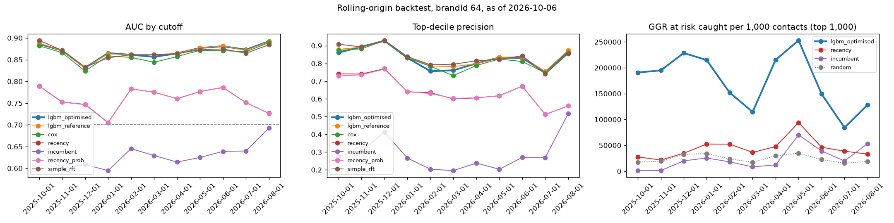

# Backtest v0: rolling-origin (brandId 64)

Does the model predict the way it will be used: trained on the past, scored on a date, judged on what the players did next, repeated over a year. Backtest id `backtest_brand64_2026-10-06_1792074259`, data as of 2026-10-06, 11 test cutoffs, 121 min. Config: `configs/backtest.yaml`.

**Verdict: FAIL** (a model that fails is not promoted, whatever its single-split scores).

| Pass condition (delivery plan) | Candidate (`lgbm_optimised`) | Result |
|---|---|---|
| mean top-decile precision >= 1.10x the recency rule | 0.829 vs 0.645: 1.28x [1.23, 1.35] | pass |
| AUC never below 0.7 | min 0.831 (2025-12-01) | pass |
| ECE never above 0.08 | max 0.118 (2025-12-01) | FAIL |

## How It Runs

- **Test cutoffs**: the first day of each month, 2025-10-01, 2025-11-01, 2025-12-01, 2026-01-01, 2026-02-01, 2026-03-01, 2026-04-01, 2026-05-01, 2026-06-01, 2026-07-01, 2026-08-01. Skipped (fewer than 2 earlier months with a known label): 2025-09-01.
- **Training at each cutoff C**: every earlier monthly cutoff whose 60-day label was already known on C (cutoff + 60 days <= C), labels computed from data up to C only; the latest 1 of them are the validation months (early stopping, tuning, calibration). So the training data grows from 2 to 12 months, and the models never see a label C did not know.
- **Scored**: every player with a bet in the 30 days up to C, judged on the 60 days after it (data up to 2026-10-06).
- **Calibration level on C**, as scoring sets it (`src/models/calibration_level.py`): one log-odds shift per brand, the median of the shifts that set the mean probability right on the last 3 months with a known label and on the later months' early signal (who has bet again by C). It changes no ranking, only the ECE, log-loss and Brier; the ECE without it is in the per-cutoff table.
- **Models**: trained exactly as in normal training, with 20 Optuna trials (not 100) and at most 500 trees, as the plan allows for the backtest. Each training run is in MLflow with the tag `backtest_id`.
- **Comparators**: `lgbm_reference` (optimisation step 1), `cox` (partial hazard), `recency` (days since the last bet alone) and `incumbent` (the platform's `churn_score` in `gld_player_signals_daily`, a weighted heuristic: 0.5 recency + 0.3 frequency + 0.2 value). The plan's 7/14/30-day labels are replaced by the 60-day churn of `docs/churn_definition_v0.md`.

## Results Across Cutoffs

Mean, 95% CI of the mean, median and range. The CI is a circular block bootstrap: each of the 2000 resamples joins blocks of 3 consecutive cutoffs, because neighbouring months move together (season, players who repeat). Log-loss, ECE and Brier only for the calibrated probabilities.

| comparator | auc | c_index | top_decile_precision | top_decile_recall | log_loss | ece | brier |
|---|---|---|---|---|---|---|---|
| cox | 0.862 [0.851, 0.874] (median 0.866, range 0.824 to 0.889) | 0.795 [0.773, 0.821] (median 0.781, range 0.761 to 0.881) | 0.824 [0.784, 0.867] (median 0.825, range 0.731 to 0.929) | 0.261 [0.230, 0.286] (median 0.260, range 0.195 to 0.331) | n/a | n/a | n/a |
| incumbent | 0.630 [0.613, 0.647] (median 0.629, range 0.595 to 0.692) | 0.590 [0.574, 0.613] (median 0.580, range 0.563 to 0.677) | 0.287 [0.226, 0.349] (median 0.269, range 0.195 to 0.517) | 0.089 [0.076, 0.108] (median 0.078, range 0.069 to 0.153) | n/a | n/a | n/a |
| lgbm_optimised | 0.869 [0.858, 0.880] (median 0.871, range 0.831 to 0.892) | 0.795 [0.774, 0.820] (median 0.780, range 0.764 to 0.880) | 0.829 [0.792, 0.870] (median 0.832, range 0.752 to 0.928) | 0.263 [0.231, 0.290] (median 0.271, range 0.194 to 0.333) | 0.421 [0.390, 0.460] (median 0.410, range 0.363 to 0.549) | 0.044 [0.025, 0.065] (median 0.036, range 0.014 to 0.118) | 0.138 [0.126, 0.152] (median 0.135, range 0.116 to 0.185) |
| lgbm_reference | 0.869 [0.858, 0.880] (median 0.871, range 0.831 to 0.892) | 0.795 [0.773, 0.820] (median 0.780, range 0.763 to 0.880) | 0.837 [0.803, 0.876] (median 0.837, range 0.755 to 0.930) | 0.266 [0.233, 0.293] (median 0.278, range 0.195 to 0.335) | 0.420 [0.390, 0.460] (median 0.409, range 0.365 to 0.552) | 0.043 [0.025, 0.063] (median 0.036, range 0.013 to 0.118) | 0.138 [0.126, 0.152] (median 0.134, range 0.117 to 0.186) |
| recency | 0.759 [0.746, 0.771] (median 0.760, range 0.705 to 0.789) | 0.693 [0.680, 0.705] (median 0.689, range 0.653 to 0.724) | 0.645 [0.598, 0.704] (median 0.635, range 0.512 to 0.770) | 0.203 [0.185, 0.219] (median 0.211, range 0.161 to 0.244) | n/a | n/a | n/a |
| recency_prob | 0.759 [0.746, 0.771] (median 0.760, range 0.705 to 0.789) | 0.693 [0.680, 0.705] (median 0.689, range 0.653 to 0.724) | 0.643 [0.597, 0.701] (median 0.630, range 0.512 to 0.768) | 0.203 [0.184, 0.219] (median 0.211, range 0.161 to 0.242) | n/a | n/a | n/a |
| simple_rft | 0.867 [0.856, 0.877] (median 0.865, range 0.833 to 0.894) | 0.796 [0.775, 0.819] (median 0.783, range 0.763 to 0.875) | 0.840 [0.806, 0.881] (median 0.839, range 0.740 to 0.930) | 0.266 [0.234, 0.293] (median 0.281, range 0.195 to 0.328) | n/a | n/a | n/a |

## Month by Month against Recency (review item P1 11)

The cutoffs are not independent, so the interval alone can look too sure. This table does not depend on any resampling: the median and the worst month of each comparator, and the months where it beats the recency rule (AUC above recency; top-decile ratio at or above 1.10x).

| comparator | months | auc_median | auc_worst | auc_worst_month | months_auc_above_recency | ratio_median | ratio_worst | ratio_worst_month | months_ratio_at_threshold |
|---|---|---|---|---|---|---|---|---|---|
| lgbm_optimised | 11 | 0.871 | 0.831 | 2025-12-01 | 11 | 1.269 | 1.162 | 2025-10-01 | 11 |
| lgbm_reference | 11 | 0.871 | 0.831 | 2025-12-01 | 11 | 1.303 | 1.187 | 2025-10-01 | 11 |
| cox | 11 | 0.866 | 0.824 | 2025-12-01 | 11 | 1.234 | 1.179 | 2025-10-01 | 11 |
| incumbent | 11 | 0.629 | 0.595 | 2026-01-01 | 0 | 0.401 | 0.321 | 2026-02-01 | 0 |
| recency_prob | 11 | 0.760 | 0.705 | 2026-01-01 | 1 | 1.000 | 0.985 | 2025-10-01 | 0 |
| simple_rft | 11 | 0.865 | 0.833 | 2025-12-01 | 11 | 1.310 | 1.207 | 2025-11-01 | 11 |

## AUC per Cutoff

| cutoff | n_players | churn_rate | n_train_cutoffs | lgbm_optimised | lgbm_reference | cox | recency | incumbent | recency_prob | simple_rft | ECE lgbm_optimised | ECE without level | level shift |
|---|---|---|---|---|---|---|---|---|---|---|---|---|---|
| 2025-10-01 | 17059 | 0.360 | 2 | 0.886 | 0.888 | 0.882 | 0.789 | 0.640 | 0.789 | 0.894 | 0.014 | 0.014 | -0.009 |
| 2025-11-01 | 17318 | 0.412 | 3 | 0.871 | 0.871 | 0.866 | 0.752 | 0.599 | 0.752 | 0.871 | 0.055 | 0.063 | 0.066 |
| 2025-12-01 | 14615 | 0.478 | 4 | 0.831 | 0.831 | 0.824 | 0.747 | 0.609 | 0.746 | 0.833 | 0.118 | 0.120 | 0.013 |
| 2026-01-01 | 8978 | 0.363 | 5 | 0.865 | 0.864 | 0.859 | 0.705 | 0.595 | 0.705 | 0.854 | 0.036 | 0.035 | -0.220 |
| 2026-02-01 | 8740 | 0.260 | 6 | 0.861 | 0.861 | 0.855 | 0.783 | 0.645 | 0.783 | 0.862 | 0.084 | 0.133 | -0.347 |
| 2026-03-01 | 9675 | 0.282 | 6 | 0.857 | 0.862 | 0.844 | 0.775 | 0.629 | 0.775 | 0.861 | 0.048 | 0.119 | -0.495 |
| 2026-04-01 | 9457 | 0.282 | 7 | 0.864 | 0.864 | 0.857 | 0.760 | 0.614 | 0.760 | 0.864 | 0.039 | 0.039 | -0.002 |
| 2026-05-01 | 9546 | 0.293 | 9 | 0.877 | 0.877 | 0.872 | 0.777 | 0.625 | 0.776 | 0.873 | 0.014 | 0.021 | 0.052 |
| 2026-06-01 | 9087 | 0.286 | 10 | 0.881 | 0.882 | 0.871 | 0.786 | 0.639 | 0.786 | 0.875 | 0.025 | 0.016 | -0.073 |
| 2026-07-01 | 7971 | 0.226 | 11 | 0.873 | 0.871 | 0.868 | 0.751 | 0.640 | 0.751 | 0.865 | 0.035 | 0.039 | -0.038 |
| 2026-08-01 | 10261 | 0.337 | 12 | 0.892 | 0.892 | 0.889 | 0.727 | 0.692 | 0.726 | 0.884 | 0.015 | 0.023 | -0.094 |

## Targeting Replay (would it have paid?)

A campaign that contacts the top **1,000** players at every cutoff (N to agree with the CRM team). The candidate ranks by **value at risk** = trailing-90-day mean daily GGR x 30 x its churn probability; `recency` and `incumbent` rank by their own score; `random` is the expected value of a random pick. **Realised GGR at risk** = the 30-day value of the players who did churn. No treatment was applied, so this measures targeting quality, not uplift.

| ranking | churn_captured | ggr_at_risk_captured | ggr_at_risk_per_1000 |
|---|---|---|---|
| incumbent | 0.090 [0.056, 0.120] (median 0.095, range 0.013 to 0.166) | 0.105 [0.048, 0.166] (median 0.083, range 0.004 to 0.278) | 24,412.103 [13,650.275, 36,213.303] (median 19,723.355, range 1,068.702 to 70,160.015) |
| lgbm_optimised | 0.095 [0.072, 0.114] (median 0.098, range 0.054 to 0.129) | 0.676 [0.610, 0.732] (median 0.688, range 0.483 to 0.766) | 175,060.023 [142,307.656, 204,105.966] (median 190,822.428, range 84,285.800 to 252,948.023) |
| random | 0.096 [0.077, 0.110] (median 0.105, range 0.058 to 0.125) | 0.096 [0.077, 0.110] (median 0.105, range 0.058 to 0.125) | 24,123.709 [19,701.697, 28,467.467] (median 22,482.040, range 15,481.310 to 34,635.582) |
| recency | 0.198 [0.146, 0.239] (median 0.219, range 0.105 to 0.281) | 0.185 [0.120, 0.241] (median 0.172, range 0.064 to 0.313) | 44,054.388 [32,571.874, 56,233.916] (median 38,668.330, range 21,641.652 to 94,030.806) |

## Value-Matched Policies (review items P0 4 and P0 5)

Every risk score ranks the same players with the same 1,000 contacts, alone (value-blind) and multiplied by the expected 30-day GGR (value-aware). `recency` is the days since the last bet turned into a probability, `simple_rft` a logistic regression on recency, frequency and tenure (both fitted on the training months of each cutoff), `lgbm_60d` the candidate, and `cox_30d` the `p_churn_30d` that scoring writes, so `cox_30d` value-aware is the `value_at_risk_30d` of `player_scores`. Mean over the cutoffs.

| Score | Churners caught, value-blind | GGR at risk caught, value-blind | Churners caught, value-aware | GGR at risk caught, value-aware | Months value-aware beats `simple_rft` value-aware |
|---|---|---|---|---|---|
| `recency` | 19.8% | 18.3% | 4.9% | 60.5% | 0 of 11 |
| `simple_rft` | 26.0% | 5.2% | 9.3% | 67.4% |  |
| `lgbm_60d` | 25.7% | 4.8% | 9.5% | 67.6% | 8 of 11 |
| `cox_30d` | 25.6% | 4.6% | 5.3% | 61.3% | 0 of 11 |

Split of the GGR at risk caught by the final policy (`lgbm_60d` value-aware) against value-blind recency:

- **Predictive uplift** (`lgbm_60d` against `simple_rft`, both value-aware): +0.3 points.
- **Value-weighting uplift** (`lgbm_60d` value-aware against value-blind): +62.8 points.
- **Combined** (`lgbm_60d` value-aware against `recency` value-blind): +49.3 points.

### Cox 30-day against LightGBM 60-day value at risk

Share of the top 1,000 players in both lists: mean 66% (range 55% to 74%). Spearman correlation of the two values at risk: 0.863; of the two probabilities: 0.977.

## Calibration Level: the Early Churn Estimate (review item P0 3)

On a scoring date the calibration level estimates the 60-day churn rate of the recent cohorts, whose label is not complete yet, from data up to that date only: the share of the cohort with no bet so far, times the share of the last complete cohort that, silent after the same number of days, stayed silent for 60 days (`calibration_level.early_rate`). Here the estimate is replayed for every monthly cohort 14, 21, 30, 45 days after its cutoff, with data up to that day only, and set against the rate known today and against simply using the rate of the last complete cohort. Mean absolute error, in points of churn rate.

| Days observed | Cohorts | Mean realised rate | Error of the early estimate | Error of the last complete month |
|---|---|---|---|---|
| 14 days | 12 | 32.7% | 2.30 | 6.11 |
| 21 days | 12 | 32.7% | 1.99 | 6.11 |
| 30 days | 13 | 33.0% | 1.13 | 5.12 |
| 45 days | 13 | 33.0% | 0.49 | 4.66 |

The early estimate is closer to the realised rate in 42 of 50 cohorts.

## Cox PH per Horizon (review item P1 7)

The calibrated Cox probability of churn starting within h days, against the h-day label, on the players whose label is known. Mean over the cutoffs (range).

| Horizon | Players per cutoff | Churn rate | AUC | Brier | ECE |
|---|---|---|---|---|---|
| 7 days | 11,245 | 0.358 | 0.853 (0.824 to 0.876) | 0.162 | 0.104 (0.055 to 0.194) |
| 14 days | 11,245 | 0.386 | 0.847 (0.821 to 0.869) | 0.165 | 0.097 (0.045 to 0.175) |
| 30 days | 11,245 | 0.446 | 0.836 (0.815 to 0.857) | 0.172 | 0.093 (0.033 to 0.214) |

## How to Read It

- **Top-decile condition at 1.10x, not the plan's 1.5x** (`docs/decision_top_decile_condition.md`): precision cannot exceed 1 and the recency rule already reaches 0.645, so the most any model could reach is 1.55x, and this ceiling falls in the months with more churn. 1.10x is the strictest round value the model meets with 95% confidence in brands 14, 64 and 73, and at today's precisions it is the plan's own demand (1.5 times the churners found per wasted contact). Interval: 95%, circular block bootstrap of 3 consecutive cutoffs, 2000 resamples.
- **Calibration lags the churn rate**: the calibration month is the latest one whose 60-day label was known on C, 2 to 3 months before it. When the monthly churn rate moves between them (around 50% from November to January, 30 to 40% the rest of the year), every probability is off by about the same amount: the ECE rises while the AUC does not move. The level shift on C removes most of it. What is left comes from the 60 days after C (a holiday season, a sports calendar), which no data before C shows: in the analysis of 2026-10-09 even the exact level of the month before C would not have kept every month of brand 14 under 0.08 (`eda/07_calibration_seasonality.ipynb`).
- **The replay trades churners for value**: the candidate ranks by value at risk, so it contacts fewer players who churn than recency does, but the ones it contacts carry most of the GGR at risk. Ranking by churn probability alone is the top-decile columns above.
- **The cutoffs are not independent**: the players repeat and the training months overlap. The CIs resample blocks of consecutive months, which keeps the dependence between neighbouring months, but not players, so they can still be a little optimistic; the month-by-month counts do not depend on any resampling.
- **The winsorisation caps** come from the main pipeline's configuration (they may have seen later months' features, never labels).
- **Early cutoffs train on few months**, and on no deposit data before March 2026 (the deposit features are empty then). Training cutoffs before 2025-09 have under 150 days of history, so `days_since_first_bet` (capped at 150) is lower there for the same players.

Generated by `src/models/backtest.py` (`make backtest`). Tables: `data/03_output/backtest/backtest_brand64_2026-10-06_1792074259_metrics.csv`, `data/03_output/backtest/backtest_brand64_2026-10-06_1792074259_replay.csv`.
