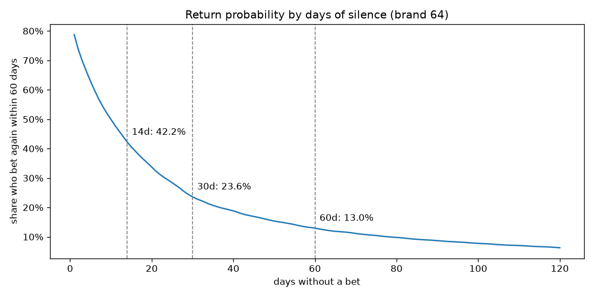
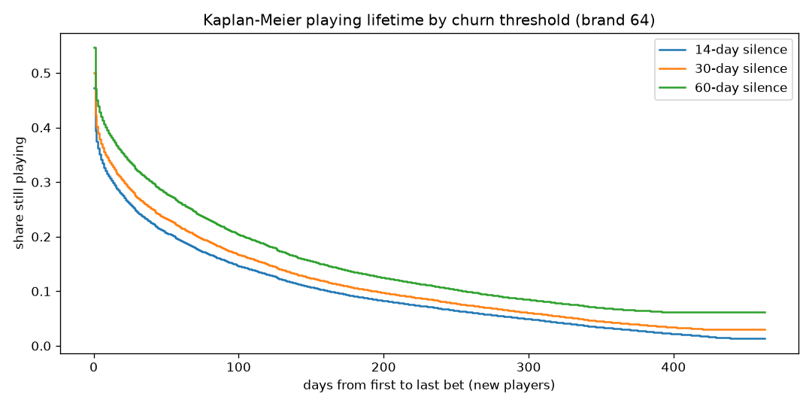
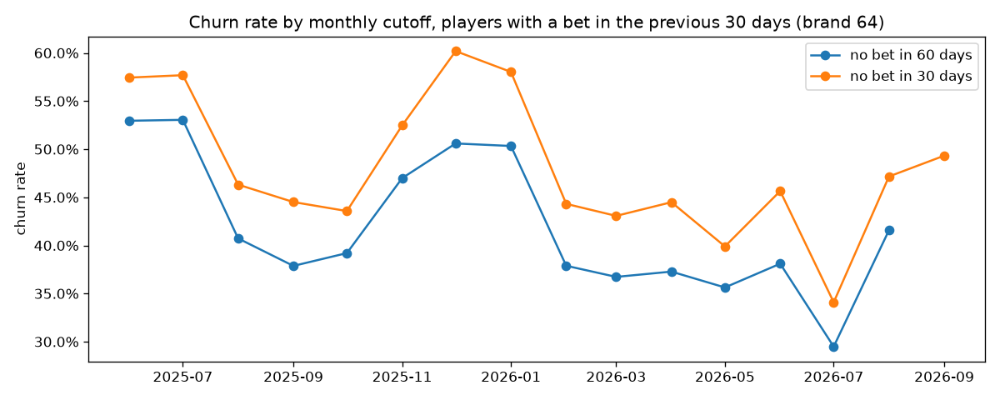

# Baseline Churn Definition v0.2 (brandId=64, gold layer)

## 0. What Changed from v0.1

v0.1 was built on the landing layer, with 104 days of history (2026-06-18 to 2026-09-29). This version re-runs the analysis on the **gold layer** (`org/40-gold`), the project's data source from now on, with **18 months of history** (2025-04-01 to 2026-10-06). The longer history changes the numbers a lot, mostly because a return after a long silence can now actually be observed. The decision (60 days) does not change, and it now rests on much stronger evidence.

Notebook: `eda/02_churn_definition.ipynb`. Tables and figures: `data/03_output/churn_definition/brand64/`.

## 1. Summary and Core Definition

A player has **churned** when **60 days pass without a bet**. The activity event is a day with at least one bet, from any wallet (real money or bonus).

- After 60 days of silence, **13.0%** of players bet again within the next 60 days (9.6% for all brands). After 30 days of silence it would be 23.6%: one "churned" player in four would come back.
- Going further than 60 days gains little: 8.7% come back after 90 days of silence, and from 60 days on each extra month of waiting removes less than 5 points of false churn.
- The churn rate of the active population moves between **29.5% and 53.1%** from one monthly cutoff to the next, with clear seasons.

## 2. Activity Data

I build player activity from `gld_player_gaming_daily`: one row per player, game, provider, day and currency with play that day. `src/features/gold_cache.py` (`activity` cache) sums it to one row per player and day with at least one bet, filtered to `brandId = 64` (126,581 players, 1,640,224 player-days). I use this table rather than `gld_player_signals_daily` because it carries `brand_id` on every row; `signals_daily` has no `brand_id` before July 2026 (see `docs/dq_reports/gold/`). Days are UTC days, as everywhere in gold.

The cache is local and incremental, and it re-reads the last 7 days on every run, because gold reprocesses its last 7 days daily.

## 3. Evidence

### Return probability by days of silence

For each number of silent days `d`: the share of players who bet again within the next 60 days. Only silences that reached day `d` at least 60 days before the end of the data count, so every value has the same chance to see a return (the "fair" rate).

| Days of silence | Brand 64 | All brands |
|---|---|---|
| 7 | 56.9% | 44.2% |
| 14 | 42.2% | 30.4% |
| 30 | 23.6% | 17.0% |
| **60** | **13.0%** | **9.6%** |
| 90 | 8.7% | 6.5% |
| 120 | 6.3% | 4.4% |



The curve has no sharp plateau, but it flattens: 30 more days of silence remove 10.6 points from 30 to 60 days, 4.3 points from 60 to 90 and 2.4 points from 90 to 120.

### Return after dormancy, raw

Every silence that reached the threshold, with any later return (up to 18 months of follow-up); a silence still running counts as no return.

| Threshold | Silences | Returned | Still dormant | Return rate (raw) | Return rate (fair, 60 days) |
|---|---|---|---|---|---|
| 14 days | 240,862 | 125,569 | 115,293 | 52.1% | 42.2% |
| 30 days | 170,999 | 60,754 | 110,245 | 35.5% | 23.6% |
| 60 days | 135,848 | 32,910 | 102,938 | 24.2% | 13.0% |

The raw rates are higher because a return can come months later. The fair rate is the one that matches how the label is used.

### Kaplan-Meier: playing lifetime of new players

New players (first bet after 2025-06-30, so that the first bet is really the first): 66,390. Lifetime = days from the first to the last bet; churn confirmed when the silence after the last bet reaches the threshold.

| Threshold | Confirmed churns | Censored | Median lifetime |
|---|---|---|---|
| 14 days | 59,793 | 9.9% | 0 days |
| 30 days | 56,068 | 15.5% | 1 day |
| 60 days | 50,225 | 24.3% | 1 day |



About half of the new players stop within a day of their first bet.

### Churn rate by monthly cutoff

Players with a bet in the 30 days up to the cutoff (the population of the features), and the share with no bet in the next 30 and 60 days.

| Cutoff | Players | No bet in 30 days | No bet in 60 days |
|---|---|---|---|
| 2025-06-01 | 34,106 | 57.4% | 53.0% |
| 2025-07-01 | 27,427 | 57.7% | 53.0% |
| 2025-08-01 | 19,120 | 46.3% | 40.7% |
| 2025-09-01 | 18,433 | 44.5% | 37.9% |
| 2025-10-01 | 19,279 | 43.6% | 39.2% |
| 2025-11-01 | 22,163 | 52.5% | 47.0% |
| 2025-12-01 | 17,727 | 60.2% | 50.6% |
| 2026-01-01 | 14,569 | 58.0% | 50.3% |
| 2026-02-01 | 11,878 | 44.3% | 37.9% |
| 2026-03-01 | 12,622 | 43.1% | 36.7% |
| 2026-04-01 | 13,187 | 44.5% | 37.3% |
| 2026-05-01 | 12,823 | 39.9% | 35.6% |
| 2026-06-01 | 12,982 | 45.6% | 38.1% |
| 2026-07-01 | 10,463 | 34.1% | 29.5% |
| 2026-08-01 | 13,996 | 47.2% | 41.6% |
| 2026-09-01 | 14,092 | 49.3% | not observable yet |



## 4. Operational Label

For a cutoff `c` (the "today" of a snapshot), within `brandId = 64`:

```
population      = players with a bet in (c - 30, c]
event_60d       = 1 if the player places no bet in (c, c + 60], else 0
duration_days   = first day t >= c (the cutoff or a later active day) followed by 60 days without a bet
event_observed  = 1 if that 60-day silence fits inside the data, else 0 (censored at the last active day)
```

`event_60d` is the classification target (LightGBM). `duration_days` and `event_observed` are the survival targets (Cox PH). A label is only usable when `c + 60` is on or before the last data day, and only final once `c + 60` is at least 7 days before it (gold reprocesses its last 7 days).

**Known limits:**
- **Left truncation**: history starts on 2025-04-01, so a player seen in the first months may have started earlier. The lifetime curves use new players only; the labels do not depend on the first bet.
- **Bonus-only players**: the event is any bet, including bets placed only with bonus money. Gold's own "active day" excludes playable-bonus-only bets (`gld-schemas.xlsx`), so `active_days_*` in the gold signals can be lower than this definition. To review if bonus-only play should not count as activity.
- **Backfilled history**: gold recomputed its history in July and August 2026. That the backfill only uses data up to each day must be confirmed with the data team (open question in the data card).

## 5. Decision: 60 Days

I keep **60 days** as the churn threshold for `brandId=64`. The plan proposes 30 days as a provisional value; the evidence below is why I do not use it.

### What the threshold trades

The threshold balances two costs:

- **A short threshold gives false churns.** A player called "churned" who then bets again is a wrong label, and the model learns from it. I measure this with the fair return rate: the share who bet again within the next 60 days.
- **A long threshold gives late and fewer labels.** A label can only be known `threshold` days after the cutoff, so the newest model is trained on older data, the business learns that a player is gone later, and fewer cutoffs have a complete label.

| Threshold | False churns (bet again within 60 days) | Reduction from 30 more days of waiting | Monthly cutoffs with a complete label |
|---|---|---|---|
| 14 days | 42.2% | 25.0 points (to 44 days) | 16 |
| 30 days | 23.6% | 10.6 points | 16 |
| 45 days | 16.9% | 6.5 points | 15 |
| **60 days** | **13.0%** | **4.3 points** | **15** |
| 75 days | 10.5% | 3.1 points | 14 |
| 90 days | 8.7% | 2.4 points | 14 |

### Why 60

1. **It is where waiting stops paying.** Up to 60 days, each extra month of silence removes a large share of the false churns (10.6 points from 30 to 60 days). From 60 days on, an extra month removes less than 5 points (4.3 from 60 to 90, 3.1 from 75 to 105). The curve has no sharp elbow, so this is a judgement, but the change of pace is clear.
2. **The error level is acceptable.** 13.0% of the players labelled churned come back within 60 days (9.6% for all brands). The return rate first drops below 15% at 52 days of silence and below 10% at 79 days. 60 days is the first standard window (30, 60, 90 days) below 15%, and windows of whole months are easier to explain and to operate than 52 days.
3. **30 days is too noisy.** About one label in four (23.6%) would be wrong, nearly twice the 60-day rate.
4. **90 days costs more than it gains.** It removes 4.3 more points of false churn, but every label arrives a month later, the training data is a month older (the behaviour of the players changes with the season, see the monthly churn rates), the business is told a month later, and one monthly cutoff is lost (14 instead of 15).
5. **It is conservative for the other brands.** Their players return less often than brand 64's (9.6% vs 13.0% after 60 days of silence), so the same threshold gives them cleaner labels.

### If an objective rule is preferred

The threshold can also be fixed by a rule decided in advance, for example "the shortest silence after which fewer than X% of players come back within 60 days":

| Rule | Threshold |
|---|---|
| fewer than 20% come back | 37 days |
| fewer than 15% come back | 52 days |
| fewer than 10% come back | 79 days |

60 days sits between the 15% and the 10% rules, closer to the first.

**Decision v0.2**: `event_60d` is the training target. The 30-day rate stays in the analysis as an earlier signal and for comparison. With 15 monthly cutoffs that have a complete 60-day label (2025-06-01 to 2026-08-01), the 12-cutoff rolling-origin backtest of the plan (T10) is possible.

## 6. Sign-off

| | |
|---|---|
| Proposed by | Javier, 2026-10-07 |
| Reviewed by (supervisor) | |
| Decision | ☐ approved ☐ changes requested |
