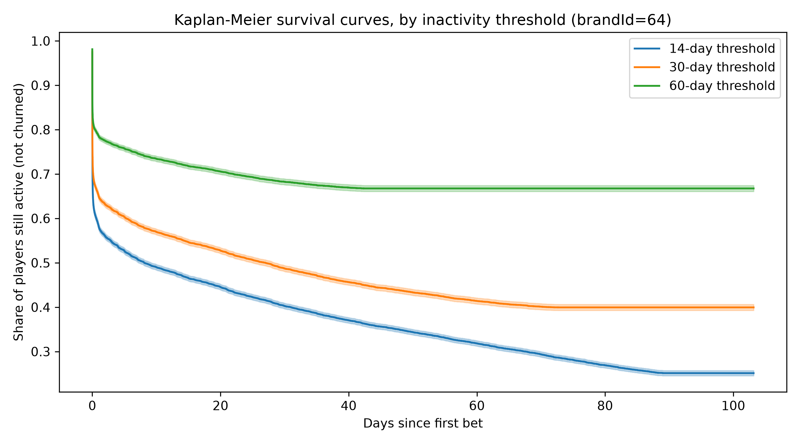

# Baseline Churn Definition v0.1 (brandId=64)

## 0. Scope Change from v0: One Brand, Not All Brands

This version re-runs the whole analysis below for a single brand, **`brandId = 64`** (`primus` only, and I confirmed that `brandId` does not exist in `secundus`'s data), instead of pooling every brand together as the original v0 did. There are two reasons: each operator's landing data mixes several distinct brands (13 under `primus`, 8 to 9 under `secundus`, with no overlap between the two), and different brands behave differently, as the numbers below show directly. Working one brand at a time is also what lets this same methodology scale to every brand later without a rewrite, so I keep `brandId` explicit throughout instead of dropping it.

Where it is useful, the tables below keep the original all brands numbers side by side as a reference point, not because they still apply, but because the size of the difference is itself informative.

## 1. Executive Summary and Core Definition

This document defines **Player Churn** for the baseline scoring pipeline, for `brandId=64`.

Churn is an **inactivity threshold** on `bet` events: a player has churned after `N` days with no `bet`. I use `bet` as the activity signal, not `player` (profile changes, not play) and not `transaction` or payments (deposits and withdrawals, much rarer than bets, and a player can keep playing for days on existing balance without a new deposit).

I test three thresholds, `N = 14, 30, 60` days, side by side:

- **14 days**: an early signal. Easy to confirm, but noisy: 47.7% of players labelled "churned" under this rule later return (fair comparison, see Section 3), even noisier than the all brands figure (32.6%).
- **30 days**: 21.1% of players still return after 30 days of silence (fair comparison), also higher than the all brands figure (14.8%).
- **60 days**: the safest definition. Even so, 5.8% of players still return after this for `brandId=64`, higher than the 3.8% seen across all brands pooled together. With only around 104 days of history, this threshold also has the most missing information: 75.8% of this brand's players cannot be confirmed yet either way, noticeably higher than the all brands figure of 64.4%.

Every one of these numbers is less favourable for `brandId=64` than for the all brands pool, which is consistent with this brand's players being slower to confirm as churned in general (see the survival curve results in Section 3). This does not change the conclusion in Section 5, it changes how confident I should be when reading the number, 5.8% residual noise at 60 days instead of 3.8%.

## 2. Session Reconstruction Methodology

There is no `session` table in `10-landing` (I checked for both operators, see `01_profiling.ipynb`). I rebuild player activity from `bet.dateTime`, filtered to `brandId = 64`, in two ways:

**a) First and last bet per player**: one row per player, with `first_bet`, `last_bet`, `n_bets`. This is a simple `GROUP BY partyId` in DuckDB, run directly on the S3 files, with `WHERE brandId = 64` added to the query. I use this for the Kaplan Meier labels.

**b) Active days per player**: one row per (player, day with at least one bet), with the same `brandId` filter. I use this for the return after dormancy analysis.

Both cover the full history (`2026-06-18` to `2026-09-29`, 104 days). Unlike the original v0 pass, this only scans `primus` (`brandId=64` does not exist in `secundus`, which I confirmed before relying on it), so only one operator's files need to be opened, not both. The filter itself does not speed up the S3 scan (DuckDB still opens every small hourly file to check which rows match `brandId = 64`, and that cost is driven by file count, not by how selective the filter is, see `01_profiling.ipynb`), but skipping `secundus` entirely cuts the file opening cost roughly in half on its own. Everything downstream of the scan (the pandas DataFrame, the cached file, every fit after that) is also much smaller and faster with one brand's worth of data: **30,342 players**, versus 385,328 for all brands pooled. Both results are saved to local files (`player_activity_span_brand64.parquet`, `active_day_gaps_brand64.parquet`) after the first run, so this cost is paid only once.

## 3. Empirical Justification & Survival Analysis

### Return after Dormancy Analysis

For each threshold: of all the times a player went quiet for at least `N` days, how often did they come back later?

First result (raw, brandId=64):

| Threshold | Returns | Still dormant (no return) | Return rate (raw) |
|---|---|---|---|
| 14d | 11,553 | 19,615 | 37.1% |
| 30d | 2,700 | 14,633 | 15.6% |
| 60d | 464 | 7,516 | 5.8% |

**This raw comparison is not fair**, for the same reason as the original v0 analysis: a player only counts as "still dormant" at 60 days if their last bet was early enough in the window to allow 60 full days to pass, so each threshold is measured on a different slice of the timeline, not just a different silence length.

**Fixed comparison**: use the same player group for all three thresholds (only players whose last bet allows a full 60 day check):

| Threshold | Returns | Still dormant (no return) | Return rate (fair) | Return rate (fair, all brands, reference) |
|---|---|---|---|---|
| 14d | 6,851 | 7,516 | **47.7%** | 32.6% |
| 30d | 2,007 | 7,516 | **21.1%** | 14.8% |
| 60d | 464 | 7,516 | 5.8% | 3.8% |

Fixing this does not weaken the finding, it makes it stronger, same as in the original v0 pass: the drop from 14 to 60 days is bigger this way (47.7% $\rightarrow$ 5.8%) than in the raw version (37.1% $\rightarrow$ 5.8%). The 60 day figure stays the same because its own rule already used this same fair group.

**In short**: for `brandId=64`, 60 days (5.8% return) is still the most reliable "this player is really gone" signal I have, same conclusion as before, but it is a noisier signal for this brand than it was for the all brands pool. Almost half of this brand's "14 day churned" players come back (47.7%), which is even more reason not to treat a 14 day or 30 day label as a final answer for this brand specifically.

### Survival Curves (Kaplan-Meier)

I fit one Kaplan Meier curve per threshold with `lifelines`, same method as before. `duration_days = last_bet - first_bet`. `event = 1` (churn confirmed) if `observation_end - last_bet >= N`; `event = 0` (**censored**) if not, meaning I simply do not know yet if that player will return.

Share of `brandId=64` players still censored (unconfirmed), out of 30,342:

| Threshold | Censored | Confirmed churns | Censored (all brands, reference) |
|---|---|---|---|
| 14d | 36.6% | 19,228 | 29.2% |
| 30d | 52.6% | 14,391 | 42.9% |
| 60d | 75.8% | 7,328 | 64.4% |



*Figure 1: Kaplan Meier survival function $S(t)$ for `brandId=64`, showing the probability of remaining inactive across duration $t$ (days), highlighting the drop in return probability at 14, 30, and 60 days.*

Median survival: 14d $\rightarrow$ 8.1 days; 30d $\rightarrow$ 27.0 days; 60d $\rightarrow$ not reached (over half the group is still censored, so the curve never gets there).

**This is a real difference from the original v0 finding, not a restatement of it.** The original note on this said the all brands medians looked very low because half of all players only ever placed bets on one day (median `duration_days` = 0.13 days across everyone). That specific problem does **not** apply here: for `brandId=64`, median `duration_days` is 0.98 days and only 3.1% of players are one bet players (compare: roughly half, in the all brands pool). The much higher medians above (8.1 and 27.0 days, instead of 0.8 and 3.9) reflect genuinely more engaged player behaviour for this brand, not a one time player artifact being less diluted. This is itself a concrete example of why pooling all brands together in v0 was hiding real, brand specific behaviour, which is exactly the motivation given in Section 0.

## 4. Operational Label Logic

For a player, with a chosen threshold `N` (days), within `brandId = 64`:

```
duration_days        = last_bet − first_bet
days_since_last_bet  = observation_end − last_bet
event_Nd              = 1  if days_since_last_bet ≥ N   (churn confirmed)
                       = 0  otherwise                    (censored, not known yet)
```

`event_Nd` is the churn label for threshold `N`. The same `duration_days` is used for all three curves, and only `event_Nd` changes. The query that builds `activity` and `gaps` now includes `brandId = 64` in its `WHERE` clause, and `brandId` is kept as an explicit column throughout rather than dropped once the filter has been applied, so the same code can loop over every brand later.

For the return after dormancy check, the same `N` day rule applies to each player's active day list, with the fair comparison group used whenever I compare more than one threshold.

**Known limits, not fixed in this version**:

- **Left truncation**: history starts `2026-06-18`. A player active before that has an unknown true first bet, so `first_bet` here means "first bet I can see", not "first bet ever". This is the same limit as v0, and it is unaffected by the brand filter.
- **Short history vs. large thresholds**: with only around 104 days of data, the 60 day threshold has little room, and it bites harder for this brand than for the all brands pool (75.8% censored here, versus 64.4% for all brands). This improves on its own as more history builds up.
- **The one time player caveat from v0 does not apply to this brand** (see Section 3), but this has only been checked for `brandId=64`. Each brand should be checked individually once this analysis is repeated for others, and I should not assume the same holds everywhere.
- **No EUR conversion needed in this notebook.** The churn-definition labels here only use `partyId` and `dateTime`, no money amounts. The project-wide EUR conversion (see `src/fx_rates.py`) applies from `03_signal_explorer.ipynb` onward, where monetary features are built.

## 5. Threshold Decision: Why 60 Days

I choose **60 days** as the churn threshold for the training label for `brandId=64`, not 30 days, same decision as the original v0 pass.

30 days is the common default, but it has a real cost for this brand: 21.1% of players labelled "churned" at 30 days later return, meaning the ground truth would be wrong roughly 1 in 5 times, worse odds than the all brands figure of about 1 in 7. 60 days brings that error down to 5.8%. That is higher than the 3.8% seen for the all brands pool, so this brand's 60 day label carries more residual noise than the original v0 estimate implied, but it is still by a wide margin the cleanest of the three options for this brand, and the gap to 30 days (21.1%) is, if anything, larger here than it was in the original analysis.

**Decision v0.1**: `event_60d` is the primary churn label for `brandId=64`. `event_14d` and `event_30d` stay in the notebook as earlier warning signals and for comparison, not as the training target. The 60 day cutoff leaves only 2 complete simulated "today" snapshots to train the early warning signals on in `03_signal_explorer.ipynb` (see that notebook for why), which is a direct and known consequence of combining a single brand's smaller population with this threshold and this much history, not a new problem introduced here.