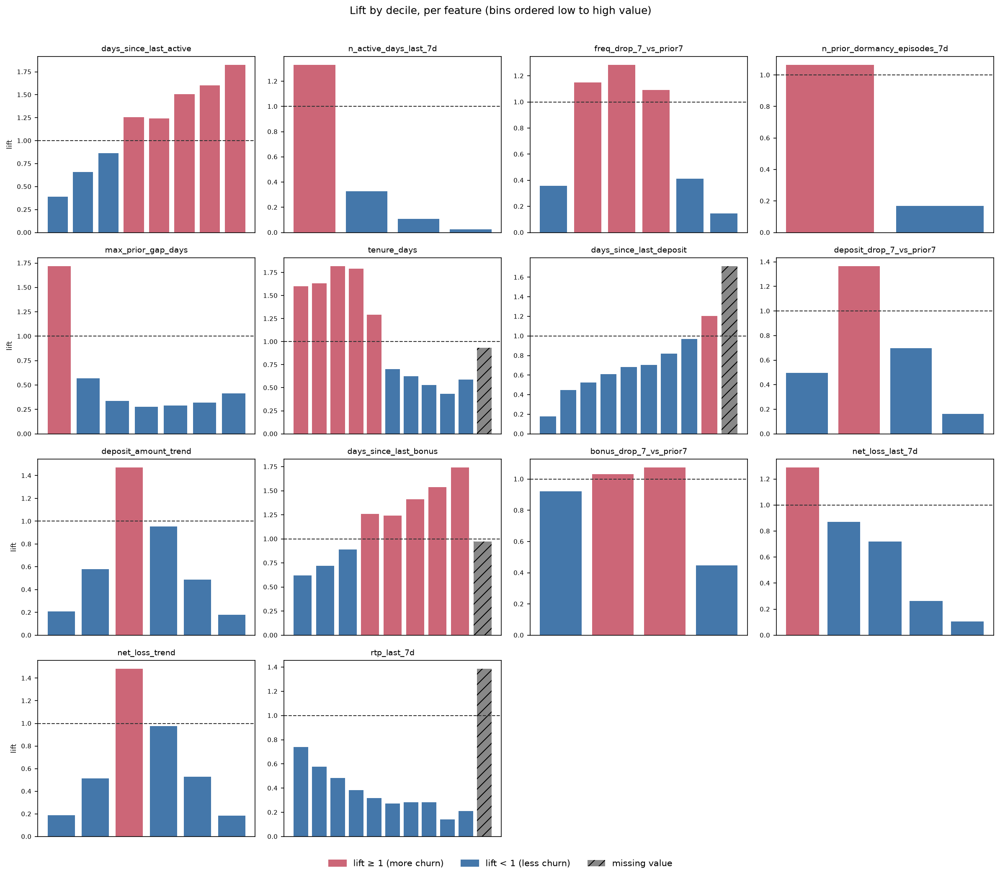
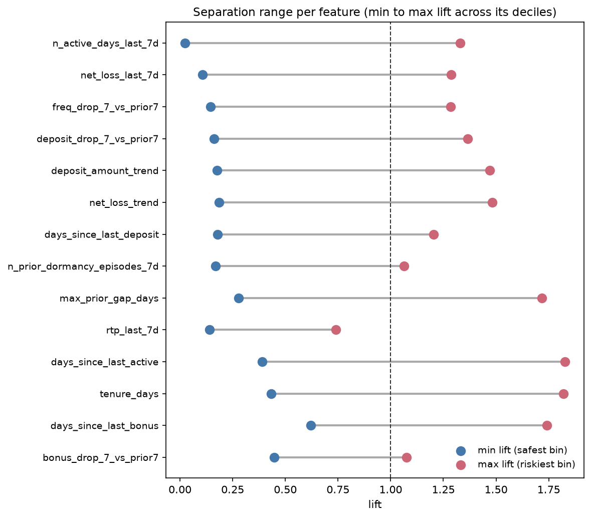
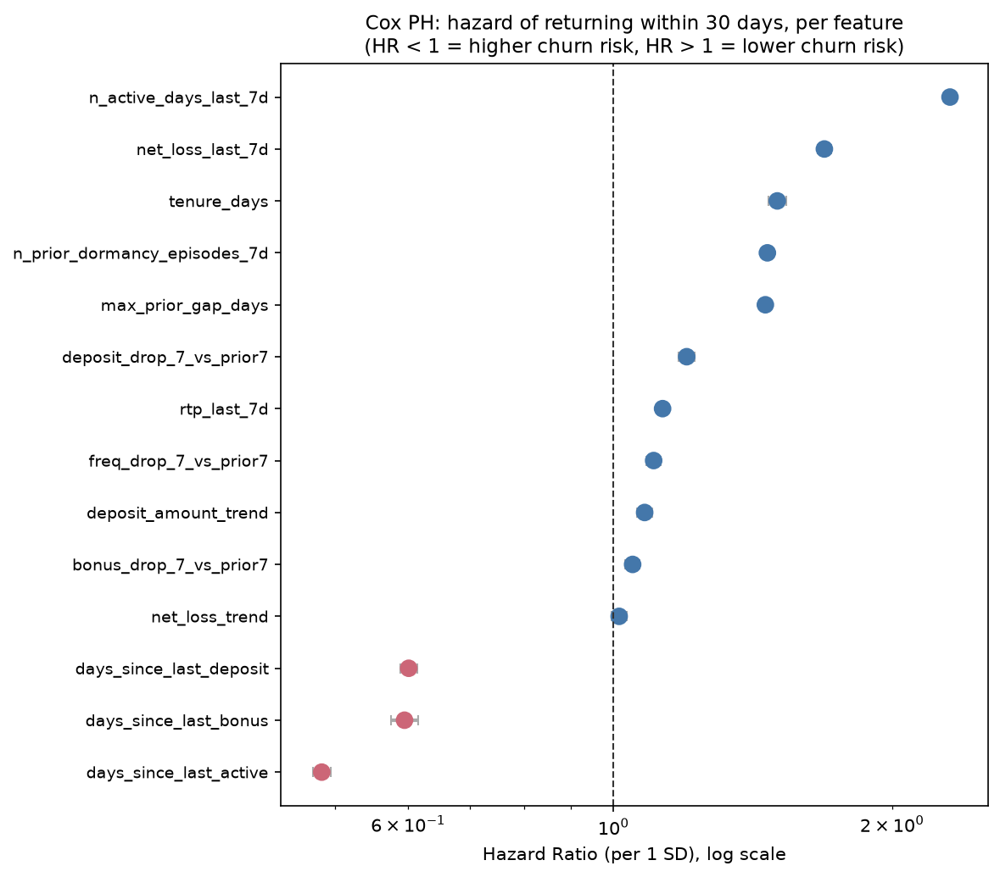
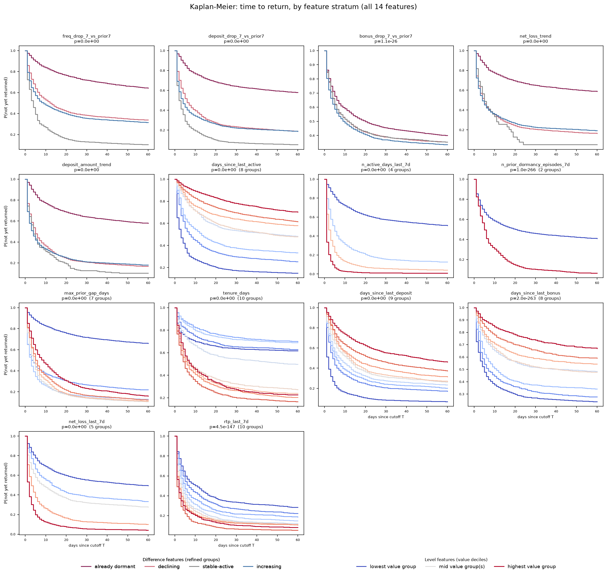
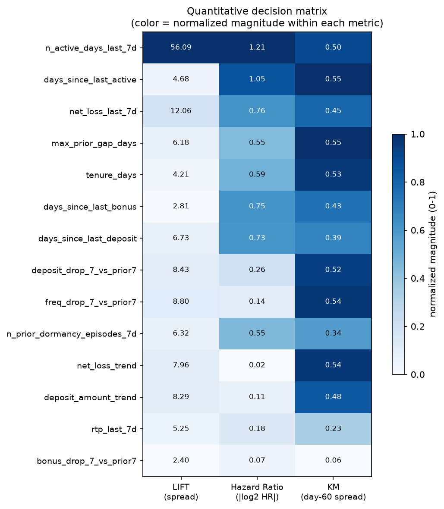

# Baseline Churn Signals and Feature Selection V0.1 (brandId=64)

This document explains the work behind the early-warning signal analysis for player churn, done before building the real Feature Store. The question this work answers is simple to state but needed real testing to answer: **which player behaviors, measured before a player goes quiet, actually give an advance signal that they are about to go quiet?**

## 0. Scope Change from V0: One Brand, EUR, and the 60-Day Label

This version re-runs the whole analysis for a single brand, **`brandId = 64`** (`primus` only), in **EUR**, using the **60-day churn label**, replacing the earlier version of this document, which pooled every brand together, worked in local currency implicitly, and used a 30-day label as a practical compromise. Three changes, three reasons:

1. **One brand, not all brands.** Each operator's landing data mixes several distinct brands (13 under `primus`, 8-9 under `secundus`, no overlap between the two), and brands behave differently, as `02_churn_definition.ipynb` already showed directly: `brandId=64`'s players are far stickier than the all-brands pool (median survival 8.1 days vs. 0.8 days at the 14-day threshold). Building and validating this analysis on one brand first is how it scales to every brand later without a rewrite, I keep `brandId` explicit throughout rather than dropping it.
2. **EUR, not local currency.** `brandId=64`'s activity is in Turkish Lira (TRY). Every monetary feature below (deposits, net loss, RTP) is converted to EUR before any trend or comparison is computed (`src/fx_rates.py`), so money-based signals are on a currency that is actually comparable across brands and across time.
3. **60-day threshold, not 30.** The training label decided in `02_churn_definition.ipynb` is `event_60d`, not `event_30d`. Matching that label here matters more than having more cutoff dates to work with, even though it leaves only **2 complete cutoff dates** (`2026-07-18` and `2026-07-25`) instead of 7, a direct, known consequence of combining a 60-day threshold with a single brand's smaller, more recent history, not a bug.

I tested 14 behavioral signals, the same 14 as the original pass, built from the five data sources I have access to (`player`, `bet`, `transaction`, `bonus`, and a day-level activity table I build myself). Every signal was tested one at a time, using three different statistical methods, against `event_60d`: a player is "churned" if they place no bet for 60 days after a given reference date `T` (the "cutoff").

**The short version**: the strongest group of signals here is **Frequency / Velocity**, not Recency, a change from the all-brands version. Recency is still strong (second place), and three real data problems carried over from the all-brands pass (an "already dormant" confound, two non-monotonic signals, and RTP's signal coming mostly from missingness), confirmed again on this brand's data, in some cases more sharply. A new data-quality problem specific to this brand's data was also found and is documented in full: `transaction`'s `currency` column does not exist at all before `2026-08-27`, a real schema change in the source, not random nulls.

## 1. Why This Needed a Careful Setup, Not Just a Correlation Check

The obvious way to check "does X predict churn" is to compare X between players who later churned and players who did not. That is dangerous here, because it is very easy to let the future leak into the past by accident. If I compute "days since last bet" using the true end of the data for every player, a player who has already gone quiet by the time I look will of course show up as inactive, that is not a prediction, that is the answer already baked into the question.

To avoid this, every signal in this document is computed using a **cutoff-date simulation**, exactly as in the original pass. I pick a date `T` in the past and pretend it is "today." Every feature is computed using only activity up to and including `T`. The label, whether the player churns, is computed using only what happens strictly after `T`, in the 60 days that follow. At this threshold, with ~103 days of history and a single brand's data, only 2 cutoff dates fit (`2026-07-18`, `2026-07-25`), giving 27,261 (player, cutoff) rows to test on. The overall churn rate across both is 38.5% (35.2% at the earlier cutoff, 41.3% at the later one).

## 2. The 14 Signals, Grouped by What They Measure

Same six behavioral groups as the original pass, unchanged, since the grouping is about what kind of player behavior each signal describes, not about which brand or threshold it is tested on.

**Recency** (3 signals): `days_since_last_active`, `days_since_last_deposit`, `days_since_last_bonus`.

**Frequency / Activity Velocity** (2 signals): `n_active_days_last_7d`, `freq_drop_7_vs_prior7`.

**Monetary / Cash-Flow Trend** (2 signals): `deposit_drop_7_vs_prior7`, `deposit_amount_trend`. Both now in EUR.

**Bonus & Promotional Engagement** (1 signal): `bonus_drop_7_vs_prior7`.

**Game Experience / GGR** (3 signals): `net_loss_last_7d`, `net_loss_trend`, `rtp_last_7d`. The first two now in EUR; RTP is a ratio and is unaffected by currency either way.

**Historical Behavior** (3 signals): `tenure_days`, `max_prior_gap_days`, `n_prior_dormancy_episodes_7d`.

## 3. The Three Statistical Methods Used

Unchanged methodology from the original pass: lift (decile separation), Cox Proportional Hazards (hazard ratio on a reframed "time to return" label), and stratified Kaplan-Meier curves (the full time-to-return shape, not just a summary number), each one catching things the others can miss. See the original document's Section 3 for the full explanation of each method and why all three are used together.

One real methodological payoff from the smaller, single-brand dataset: at 1.7 million rows (all brands, 30-day threshold), every single feature's p-value rounded to zero, the sample size alone was enough to make any effect "significant," so p-values carried no information about which signals actually mattered. At 27,261 rows (this brand, 60-day threshold), the p-value is informative again, see Section 5, where one feature's p-value genuinely fails to clear significance, something that could not happen in the all-brands pass no matter how weak the real effect was.

## 4. Results, Grouped and Ranked

*Figure 1: Decile lift for all 14 candidate signals, `brandId=64`, 60-day threshold.*

*Figure 2: Minimum and maximum lift per signal, sorted by how far apart they are.*

*Figure 3: Hazard Ratio per one standard deviation, per signal. HR below 1 (red) means higher risk at higher values; HR above 1 (blue) means lower risk at higher values. Confidence intervals are visibly wider here than in the all-brands version, expected at 27,261 rows instead of 1.7 million.*

*Figure 4: Stratified time-to-return curves for all 14 signals, `brandId=64`.*

*Figure 5: The three magnitude measures (lift spread, distance of HR from 1, Kaplan-Meier separation at day 60) per signal, raw numbers in each cell.*

Averaging the composite score within each behavioral group gives the group ranking, **and it changed from the all-brands version**:

| Rank | Group | Score (brandId=64) | Score (all brands, reference) | Signals |
|---|---|---|---|---|
| 1 | **Frequency / Velocity** | 0.681 | 0.615 | `n_active_days_last_7d` (HIGH), `freq_drop_7_vs_prior7` (MEDIUM) |
| 2 | **Recency** | 0.515 | 0.680 | `days_since_last_active` (HIGH), `days_since_last_bonus`, `days_since_last_deposit` (both MEDIUM) |
| 3 | **Historical Behavior** | 0.453 | 0.313 | `max_prior_gap_days`, `tenure_days` (both HIGH), `n_prior_dormancy_episodes_7d` (LOW) |
| 4 | **Monetary / Cash-Flow Trend** | 0.381 | 0.435 | `deposit_drop_7_vs_prior7` (MEDIUM), `deposit_amount_trend` (LOW) |
| 5 | **Game Experience / GGR** | 0.354 | 0.286 | `net_loss_last_7d` (HIGH), `net_loss_trend`, `rtp_last_7d` (both LOW) |
| 6 | **Bonus Engagement** | 0.014 | 0.139 | `bonus_drop_7_vs_prior7` (LOW, only signal in this group, and now far weaker) |

**Frequency / Velocity overtakes Recency for this brand.** In the all-brands pass, simple "how long since X" questions beat everything else. For `brandId=64`, how much a player is playing *right now*, not just whether they showed up recently, separates churners from non-churners even better. **Historical Behavior also jumped from fourth place to third**, both of its non-monotonic signals (`tenure_days`, `max_prior_gap_days`) moved into the HIGH tier here (Section 5 has the detail on why these two need careful handling despite the strong ranking). **Bonus Engagement collapsed to almost no signal at all** (0.014, barely above a coin flip), the clearest brand-specific difference in this table: this brand's players do not seem to change their bonus behavior much before churning, whatever signal bonus activity carries for other brands does not transfer here.

## 5. Findings Carried Over From the All-Brands Pass, Confirmed Again

All three real problems documented in the original version of this document were re-checked against this brand's data, independently, not assumed to still hold. All three held, in some cases more strongly.

**5.1 The "already dormant" confound.** Still present in all five trend signals (`freq_drop_7_vs_prior7`, `deposit_drop_7_vs_prior7`, `bonus_drop_7_vs_prior7`, `net_loss_trend`, `deposit_amount_trend`): a naive sign-based split (declining / stable / increasing) conflates genuinely steady, active players with players who are already fully dormant in both comparison windows (zero activity, zero minus zero equals zero). The fix from the original pass (an explicit fourth "already dormant" group, carved out before the sign split) is used unchanged here, and is already built into the Kaplan-Meier code for these five signals in `03_signal_explorer.ipynb`.

**5.2 Two historical signals are still not a straight line.** `tenure_days` and `max_prior_gap_days` are both non-monotonic for this brand too, and the shape is sharper: `tenure_days`' riskiest decile is 13-25 days of tenure (lift 1.82), not the newest players (lift 1.60) or the longest-tenured ones (lift as low as 0.43 for 1021-1267 days). Both signals still need a bucketed, non-linear encoding if fed into a model, this is now confirmed on two brands' data, not an artifact of the first one.

**5.3 RTP's signal is still mostly about being missing, not the value itself.** For `brandId=64`, `rtp_last_7d` is defined for 37.9% of rows (higher coverage than the all-brands 21.1%, a smaller, more concentrated population), and its missing-value bucket again has a higher lift (1.39) than any of its own 10 real-value bins (which top out at 0.74). The same conclusion applies: this signal is largely redundant with `days_since_last_active` and `n_active_days_last_7d`, which already capture "not betting recently" more completely.

**5.4 One real difference this time: `net_loss_trend` fails to clear statistical significance.** At `p_bh = 0.159`, this is the one feature in the whole Cox analysis (14 features x 2 brand passes = 28 tests so far) that does not reject the null hypothesis. Its Hazard Ratio sits almost exactly at 1 (1.014), consistent with the already-documented finding (both in the original pass and in `03_signal_explorer.ipynb`'s own Result cell for this brand) that `deposit_amount_trend` and `net_loss_trend` behave strangely once pooled across even just 2 cutoffs: both trend measures came back flat or slightly negative for *both* churners and non-churners here, the same calendar-time confound flagged in the original document likely applies with less data available to average it out.

## 6. A New Data-Quality Finding: `transaction`'s `currency` Column Does Not Always Exist

While converting deposit amounts to EUR, 105,563 of 168,417 deposit rows (62.7%) for this brand came back with `currency = NULL`. This was not a random missing-value problem. Checking the per-day file schema directly (not inferred from the data) showed that **`transaction` (`whizdomai-payments`) has no `currency` column at all for any day before `2026-08-27`**, a real schema change partway through the available history, 70 of the 103 days (68%) predate it. `bet` (`whizdomai-transactions`) does not have this problem, its `currency` column is present on every sampled day across the full history.

Since there is no way to recover a value that was never recorded, the 70-day gap is filled with `TRY`, the same way the FX-rate gap in `02_churn_definition.ipynb`'s companion work was handled: as an explicit, documented assumption, not a verified fact for those specific rows. The assumption is well supported, not a guess: in the 34 days where the column does exist (`2026-08-27` onward), 100% of this brand's deposit transactions are TRY, matching `bet`'s currency for the same brand (also 100% TRY). This fill is implemented in both the one-off script that built the cached data for this document and in `03_signal_explorer.ipynb`'s own `deposit_amounts_daily_brand` function, with a `print` statement reporting exactly how many rows were filled each time it runs, so this assumption stays visible, not silent.

This is worth carrying forward to every future brand this analysis is repeated for: `transaction`'s schema is not stable across the full history, and this should be checked explicitly per table, per brand, rather than assumed from one brand's result.

## 7. Final Recommendation

Combining the quantitative tiers from Section 4 with the confirmed, brand-independent problems from Section 5 gives the same three-tier recommendation structure as the original document, re-evaluated on this brand's numbers.

**Ready to use as-is**: `n_active_days_last_7d`, `days_since_last_active`, `net_loss_last_7d`. All three HIGH tier, clean, monotonic, consistent across both brand passes so far.

**Ready to use with a specific, named fix**: `max_prior_gap_days` and `tenure_days` (bucketed, non-linear encoding, confirmed non-monotonic on two brands now); `days_since_last_deposit`, `days_since_last_bonus` (missing-value indicator, structural missingness); `freq_drop_7_vs_prior7`, `deposit_drop_7_vs_prior7`, `bonus_drop_7_vs_prior7`, `deposit_amount_trend` (the four-group "already dormant" definition from Section 5.1, not the raw signed difference); `net_loss_trend` (same fix, plus a note that it was not statistically significant on this brand specifically, weight it accordingly, do not drop it outright given it was significant in the all-brands pass).

**Not recommended for v0.1**: `rtp_last_7d` (redundant with already-promoted recency signals, confirmed again); `n_prior_dormancy_episodes_7d` (direction still a construction artifact, confirmed again, more sharply).

**Brand-specific note for the Feature Store build**: `bonus_drop_7_vs_prior7`'s composite score collapsed from 0.139 (all brands) to 0.014 (this brand). It stays in the "fix and use" tier because the fix itself (the already-dormant correction) is still valid and because it may carry more signal for other brands, but it should not be assumed useful by default when this pipeline runs for a brand with low bonus engagement. Per-brand feature importance, not a single fixed feature set, is likely the right design once this scales past one brand.

## 8. Known Limits, Not Fixed in This Version

- Only 2 complete cutoff dates at the 60-day threshold used throughout this document (Section 0), a direct tradeoff of matching the training label exactly rather than maximizing row count. More cutoffs become available as history accumulates.
- The `transaction.currency` schema gap (Section 6) is specific to this brand's data as checked, not yet verified for other brands, re-check it each time this analysis is repeated.
- The Cox models do not correct for the same player appearing in up to 2 rows per analysis (same caveat as the all-brands pass, smaller here since there are only 2 cutoffs instead of 7).
- This document only tests each signal on its own, same as the original pass. It does not test how the signals interact or overlap once combined in an actual model, that is the next step, once the Feature Store is built on the recommendation in Section 7.
- This is the second brand-independent confirmation of the findings in Section 5, but still only the second. A third and fourth brand, ideally one from `secundus`, would meaningfully strengthen confidence that these are general patterns, not coincidences across two brands under the same operator.
