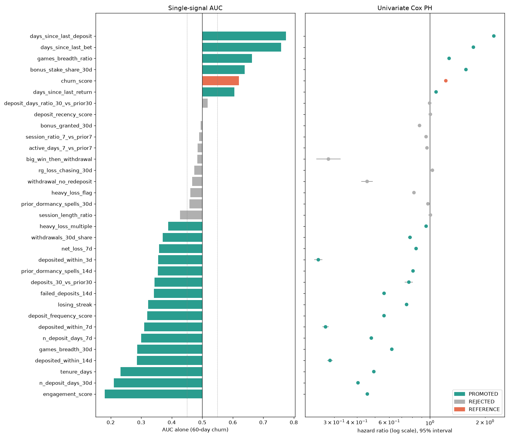
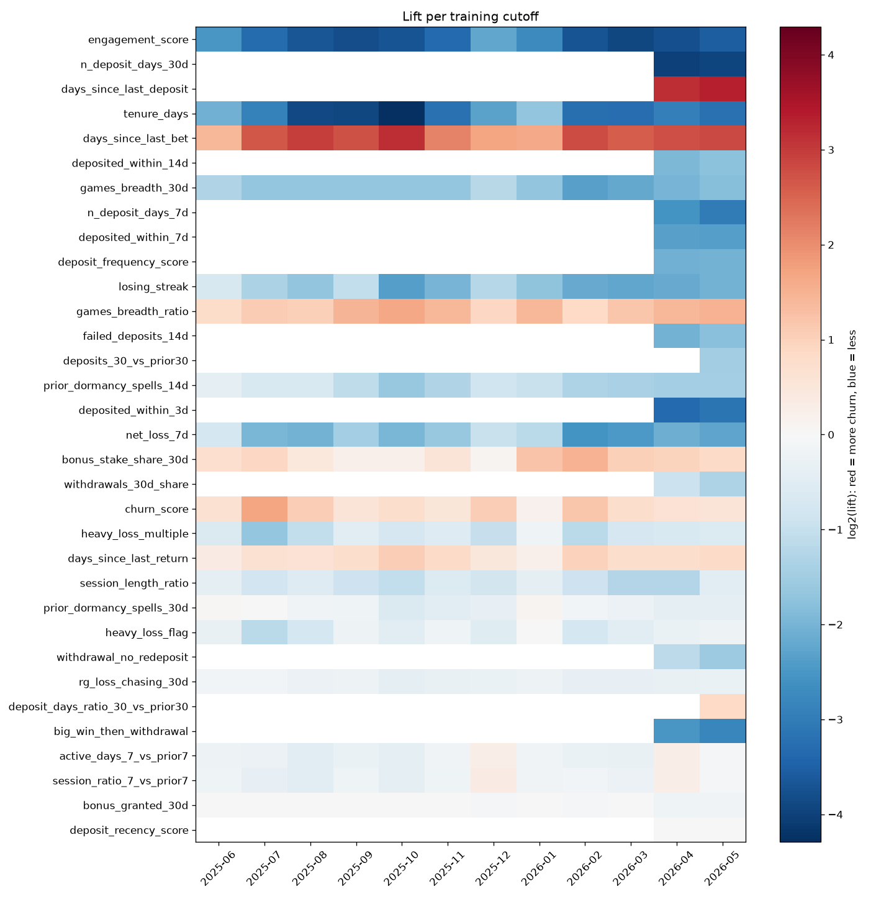
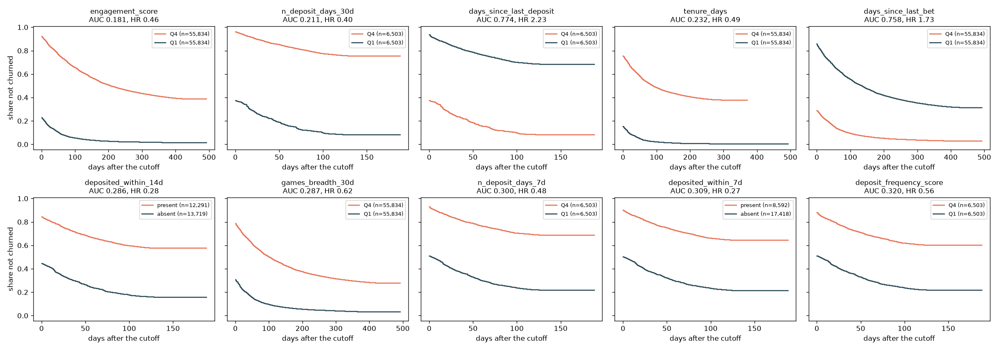

# Churn Signals v0 (brandId=64)

## 0. Scope

The plan's full hypothesis table, tested on the S3 data lake (`org/40-gold`) with **12 monthly cutoffs** (2025-06-01 to 2026-05-01, training months only; the later months are kept for the test month and the backtest). Notebook: `eda/03_signal_explorer.ipynb`; module: `eda/signal_explorer.py`; tables and figures: `data/03_output/signals/brand64/`.

## 1. Method

- **Population and label.** At each cutoff, the players of brand 64 with a bet in the 30 days up to it: 223,334 player-cutoffs, 94,481 players. Label: the 60-day churn of `docs/churn_definition_v0.md` (44.9% overall).
- **Signals.** Computed per player from data up to the cutoff only: from `gld_player_signals_daily` on the cutoff day (and 7 and 30 days before, for trends), from the daily activity and financial history, and from `gld_player_payments_daily`.
- **The same four numbers for every signal.** Lift (churn with / without the signal, or highest / lowest quartile), univariate Cox hazard ratio (per 1 SD of the sign-log value, or for the flag) with 95% intervals, single-signal AUC for the 60-day label, and the lift at each cutoff.
- **Decision rule.** PROMOTED when the hazard-ratio interval excludes 1, the AUC is at least 0.05 away from 0.5, the effect never flips side across the cutoffs, and lift, hazard ratio and AUC point the same way. Otherwise REJECTED.
- **Known limit of the intervals.** Players repeat across cutoffs, so the intervals are slightly too narrow. A player-clustered interval was the same to two decimals on a test signal and 40 times slower, so it is not used.

## 2. Data Problems Found in the Source Tables

These change what can be tested, and are reported to the data team (`docs/dq_reports/semantic_checks_brand64.md`):

1. **`gld_player_signals_daily.days_since_bet` is broken.** It is 0 for most players: it matches the recency recomputed from the daily activity for only 16% of the players (median over 18 months). Recomputed recency has an AUC of 0.758; the signals table's column has 0.500. I compute recency from the activity (`days_since_last_bet`). The other activity and money windows of the signals table match the recomputation for 95% to 100% of the players.
2. **Completed deposits and withdrawals only exist from March 2026.** From April to November 2025 no betting player has a completed deposit; the share is 1% to 8% in December and January, 34% in February, and 62% to 75% from March 2026. `gld_player_financial_daily` only has them from June 2026. Deposit and withdrawal signals are therefore left **empty (unknown, not 0)** at every cutoff whose window starts before 2026-03-01, and can only be tested on **2 cutoffs** (2026-04-01 and 2026-05-01): their effect is clear, but their stability over time cannot be checked yet.

3. **`tenure_days` is not consistent in the backfilled history.** Between two monthly snapshots, a player's tenure should grow by the days in between; it does for only 11% to 22% of the players before August 2026, and for 99% from August to September 2026 (the live period). It drifts strongly over time (adversarial AUC 0.95 in T6). The T4 result for `tenure_days` below is kept for the record, but the features use `days_since_first_bet` (days since the first bet seen, capped at 150 days), which is consistent: single-signal AUC 0.68 to 0.80 at every cutoff.

## 3. Results

### Promoted (21), by AUC

| Signal | Hypothesis | Cutoffs | AUC | Lift [95% CI] | Hazard ratio [95% CI] | Higher / present means | As the plan expected |
|---|---|---|---|---|---|---|---|
| `engagement_score` | Engagement | 12 | 0.181 | 0.10 [0.10, 0.10] | 0.46 [0.45, 0.46] | less churn | yes |
| `n_deposit_days_30d` | Deposit frequency | 2 | 0.211 | 0.06 [0.06, 0.07] | 0.40 [0.40, 0.41] | less churn | yes |
| `days_since_last_deposit` | Deposit recency | 2 | 0.774 | 9.75 [8.87, 10.72] | 2.23 [2.19, 2.28] | more churn | yes |
| `tenure_days` | Tenure | 12 | 0.232 | 0.29 [0.29, 0.30] | 0.49 [0.49, 0.50] | less churn | yes |
| `days_since_last_bet` | Bet recency | 12 | 0.758 | 5.10 [4.99, 5.21] | 1.73 [1.72, 1.73] | more churn | yes |
| `deposited_within_14d` | Deposit recency | 2 | 0.286 | 0.28 [0.27, 0.29] | 0.28 [0.28, 0.29] | less churn | yes |
| `games_breadth_30d` | Product narrowing | 12 | 0.287 | 0.31 [0.30, 0.31] | 0.62 [0.62, 0.62] | less churn | yes |
| `n_deposit_days_7d` | Deposit frequency | 2 | 0.300 | 0.15 [0.13, 0.16] | 0.48 [0.47, 0.49] | less churn | yes |
| `deposited_within_7d` | Deposit recency | 2 | 0.309 | 0.20 [0.18, 0.21] | 0.27 [0.26, 0.28] | less churn | yes |
| `deposit_frequency_score` | Deposit frequency | 2 | 0.320 | 0.25 [0.23, 0.27] | 0.56 [0.55, 0.57] | less churn | yes |
| `losing_streak` | Losing streak | 12 | 0.322 | 0.33 [0.32, 0.33] | 0.75 [0.74, 0.75] | less churn | no |
| `games_breadth_ratio` | Product narrowing | 12 | 0.663 | 2.27 [2.24, 2.31] | 1.27 [1.27, 1.28] | more churn | no |
| `failed_deposits_14d` | Failed deposits | 2 | 0.341 | 0.27 [0.25, 0.29] | 0.56 [0.55, 0.57] | less churn | no |
| `deposits_30_vs_prior30` | Deposit size trend | 1 | 0.344 | 0.35 [0.29, 0.42] | 0.77 [0.73, 0.81] | less churn | yes |
| `prior_dormancy_spells_14d` | Prior dormancy | 12 | 0.354 | 0.46 [0.46, 0.47] | 0.81 [0.80, 0.81] | less churn | no |
| `deposited_within_3d` | Deposit recency | 2 | 0.355 | 0.11 [0.10, 0.12] | 0.25 [0.23, 0.26] | less churn | yes |
| `net_loss_7d` | Heavy loss | 12 | 0.358 | 0.31 [0.31, 0.32] | 0.84 [0.84, 0.84] | less churn | no |
| `bonus_stake_share_30d` | Bonus dependence | 12 | 0.639 | 1.61 [1.59, 1.63] | 1.57 [1.56, 1.58] | more churn | yes |
| `withdrawals_30d_share` | Big win then withdrawal | 2 | 0.371 | 0.46 [0.42, 0.50] | 0.78 [0.76, 0.80] | less churn | no |
| `heavy_loss_multiple` | Heavy loss | 12 | 0.388 | 0.57 [0.57, 0.58] | 0.95 [0.95, 0.96] | less churn | no |
| `days_since_last_return` | Prior dormancy | 12 | 0.605 | 1.58 [1.56, 1.60] | 1.08 [1.07, 1.08] | more churn | no |

### Reference: the platform's current rule

`churn_score` (signals table): AUC 0.621, lift 1.77, hazard ratio 1.22. **19 signals separate churners better than it**, recency alone among them (AUC 0.758). Half of its formula is the broken recency column, which explains most of the gap.

### Rejected (11)

| Signal | Hypothesis | AUC | Lift | Reason |
|---|---|---|---|---|
| `session_length_ratio` | Session decay | 0.427 | 0.58 | hazard ratio interval includes 1; lift, hazard ratio and AUC disagree on the direction |
| `prior_dormancy_spells_30d` | Prior dormancy | 0.458 | 0.81 | AUC within 0.05 of 0.5; effect flips side at 1 cutoff(s) |
| `heavy_loss_flag` | Heavy loss | 0.461 | 0.73 | AUC within 0.05 of 0.5 |
| `withdrawal_no_redeposit` | Withdrawal without redeposit | 0.466 | 0.40 | AUC within 0.05 of 0.5 |
| `rg_loss_chasing_30d` | Heavy loss | 0.474 | 0.86 | AUC within 0.05 of 0.5; lift, hazard ratio and AUC disagree on the direction |
| `deposit_days_ratio_30_vs_prior30` | Deposit frequency | 0.518 | 1.83 | hazard ratio interval includes 1; AUC within 0.05 of 0.5; lift, hazard ratio and AUC disagree on the direction |
| `big_win_then_withdrawal` | Big win then withdrawal | 0.484 | 0.16 | AUC within 0.05 of 0.5 |
| `active_days_7_vs_prior7` | Session decay | 0.485 | 0.70 | AUC within 0.05 of 0.5; effect flips side at 2 cutoff(s) |
| `session_ratio_7_vs_prior7` | Session decay | 0.490 | 0.73 | AUC within 0.05 of 0.5; effect flips side at 2 cutoff(s) |
| `bonus_granted_30d` | Bonus dependence | 0.495 | 0.99 | AUC within 0.05 of 0.5 |
| `deposit_recency_score` | Deposit recency | 0.500 | 1.01 | hazard ratio interval includes 1; AUC within 0.05 of 0.5; lift, hazard ratio and AUC disagree on the direction |

### Figures

## 4. Findings

1. **Engagement and recency are the strongest families.** The engagement score of the signals table (active days, sessions and play time over 30 days) has an AUC of 0.181: 7.8% churn in its top quartile against 77.1% in its bottom one. Bet recency alone reaches 0.758, with 5 times more churn in the most recent-inactive quartile. Both are stable at every cutoff.
2. **Deposit behaviour is as strong as expected, where the data exists.** Deposit days in the last 30 days (AUC 0.211) and days since the last deposit (AUC 0.774) are among the strongest signals, in the direction the plan expected, on the 2 cutoffs with deposits.
3. **New players churn most** (tenure, AUC 0.232), as the churn definition already showed.
4. **Product breadth works, but as breadth, not as narrowing.** Players on more games churn less (AUC 0.287). The narrowing ratio points the opposite way to the hypothesis because a new player has no previous month to compare with.
5. **Several "risk" hypotheses point the other way: they measure volume.** A longer losing streak, a larger 7-day net loss, more failed deposits, more prior dormancy spells and a higher withdrawal share all go with **less** churn, against the plan's expectation. They are not false; they describe players who play a lot (more days, more bets, more deposit attempts), and in a one-signal test that dominates. They are promoted as predictors, but read as activity proxies; the model and the selection of T6 decide whether they add anything beyond activity.
6. **Bonus dependence works as expected**: players who play mostly with bonus money churn more (AUC 0.639).
7. **Week-on-week trends are not stable.** Sessions and active days in the last 7 days against the previous 7 flip side at 2 of the 12 cutoffs, and are rejected.
8. **Two rare flags are strong but too rare for the AUC rule.** A big win followed by a withdrawal (2% of players) and a withdrawal without a redeposit (7%) have strong lifts (0.16 and 0.41, i.e. less churn) but an AUC close to 0.5 because they concern few players. They stay out of the feature list; they could come back as interaction features if the model needs them.

## 5. Signals Promoted to Features (input to T5)

By family, with the promoted signals:

- **Recency**: `days_since_last_bet`.
- **Engagement and frequency**: `engagement_score`, `games_breadth_30d`, `games_breadth_ratio`.
- **Tenure**: `tenure_days`.
- **Deposits** (from March 2026 data only): `n_deposit_days_7d`, `n_deposit_days_30d`, `days_since_last_deposit`, `deposited_within_3d` / `7d` / `14d`, `deposit_frequency_score`, `deposits_30_vs_prior30`, `failed_deposits_14d`, `withdrawals_30d_share`.
- **Money and outcome** (activity proxies): `losing_streak`, `net_loss_7d`, `heavy_loss_multiple`.
- **Prior dormancy**: `prior_dormancy_spells_14d`, `days_since_last_return`.
- **Bonus**: `bonus_stake_share_30d`.

Many of them overlap (engagement, recency, breadth and the volume proxies all measure how much a player plays), so T6's selection will drop the redundant ones (correlation and permutation steps).

## 6. Signals Rejected (do not test again without new data)

Week-on-week session and active-day ratios (unstable), 30-day prior dormancy (unstable, weak), heavy-loss flag, the source's loss-chasing indicator, bonus granted, the source's deposit recency score, the 30-vs-30 deposit-days ratio (one cutoff, contradictory), and the two rare flags (big win then withdrawal, withdrawal without redeposit). Reasons in the table above.

## 7. Known Limits

- **Deposit signals rest on 2 cutoffs.** Their stability must be re-checked when more months with deposit data join the training window.
- **Univariate only.** Each signal is tested alone; overlaps between them are left to T6.
- **The first cutoff (2025-06-01) had only 61 days of history**, so its 90-day windows were incomplete. The feature pipeline (T6) starts at 2025-06-30 (90 days of history); removing that cutoff does not change any of the other 11 cutoffs' values (checked).
- **Hypotheses not testable with the source tables today:** vertical mix (casino, sports, live) and session length decay in minutes beyond the 7-day ratio; days since the last bonus (no daily bonus history cached).
