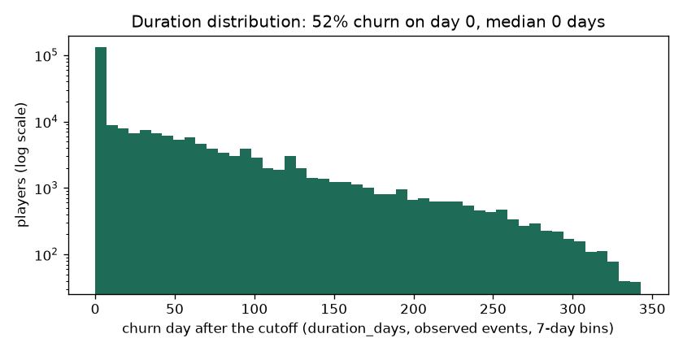
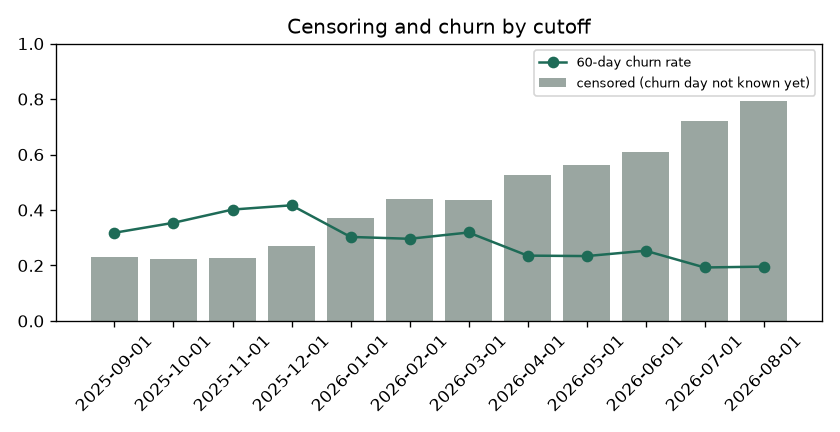

# EDA Summary vs Benchmark: Training Snapshot (brandId 23)

EDA stage 4 of the delivery plan: every statistic of the training snapshot next to its benchmark.

| | |
|---|---|
| Snapshot | `data/processed/train_dataset_23_2025-09-01_2025-10-01_2025-11-01_2025-12-01_2026-01-01_2026-02-01_2026-03-01_2026-04-01_2026-05-01_2026-06-01_2026-07-01_2026-08-01_1791545116.parquet` |
| Benchmark | `none (first dataset)` (the previous dataset of the brand) |
| Status | 0 critical, 0 warn, 0 ok |

Thresholds: row counts and null shares as in `configs/eda_alerts.yaml` (row count +-20% warn, +-50% critical; null share +5 / +20 points; PSI 0.10 / 0.25); a label rate that moves more than 5 points is a warning. Medians are in real units (days, EUR, counts).

## 1. Snapshot, Labels and Durations

| metric | current | benchmark | delta | status |
|---|---|---|---|---|
| rows | 395,163 |  |  | new |
| players | 129,202 |  |  | new |
| cutoffs | 12 |  |  | new |
| rows_per_cutoff | 32,930 |  |  | new |
| churn_rate_60d | 0.310 |  |  | new |
| churn_within_7d_rate | 0.346 |  |  | new |
| churn_within_14d_rate | 0.370 |  |  | new |
| churn_within_30d_rate | 0.414 |  |  | new |
| event_rate | 0.595 |  |  | new |
| censoring_rate | 0.405 |  |  | new |
| duration_day0_share | 0.521 |  |  | new |
| duration_p50_days | 0 |  |  | new |
| duration_p75_days | 49 |  |  | new |
| duration_p90_days | 114 |  |  | new |
| duration_max_days | 340 |  |  | new |

## 2. Censoring and Duration Distribution

`duration_days` is the day the churn starts after the cutoff (0 = no bet in the next 60 days); a player is censored when the 60-day silence that would confirm it does not fit in the data yet. Censoring grows for recent cutoffs, which have less data after them.

| cutoff_date | rows | churn_rate_60d | churn_within_7d_rate | churn_within_14d_rate | churn_within_30d_rate | censoring_rate | median_churn_day |
|---|---|---|---|---|---|---|---|
| 2025-09-01 | 42843 | 0.318 | 0.343 | 0.366 | 0.411 | 0.232 | 22 |
| 2025-10-01 | 46997 | 0.354 | 0.379 | 0.411 | 0.463 | 0.223 | 9 |
| 2025-11-01 | 48223 | 0.402 | 0.433 | 0.459 | 0.516 | 0.227 | 0 |
| 2025-12-01 | 42188 | 0.417 | 0.435 | 0.464 | 0.512 | 0.269 | 0 |
| 2026-01-01 | 31250 | 0.303 | 0.385 | 0.406 | 0.439 | 0.370 | 1 |
| 2026-02-01 | 27218 | 0.296 | 0.319 | 0.334 | 0.369 | 0.440 | 0 |
| 2026-03-01 | 29448 | 0.319 | 0.338 | 0.355 | 0.390 | 0.437 | 0 |
| 2026-04-01 | 26294 | 0.236 | 0.261 | 0.280 | 0.323 | 0.525 | 1 |
| 2026-05-01 | 26616 | 0.234 | 0.264 | 0.289 | 0.331 | 0.562 | 0 |
| 2026-06-01 | 26268 | 0.253 | 0.273 | 0.294 | 0.330 | 0.608 | 0 |
| 2026-07-01 | 23899 | 0.193 | 0.212 | 0.236 | 0.272 | 0.720 | 0 |
| 2026-08-01 | 23919 | 0.196 | <NA> | <NA> | <NA> | 0.794 | 0 |

## 3. Features

No feature flagged against the benchmark.

| feature | null share | null share, benchmark | median | PSI |
|---|---|---|---|---|
| days_since_last_bet | 0 |  | 5 |  |
| days_since_last_deposit | 0.679 |  | 11 |  |
| active_days_l7d | 0 |  | 1.000 |  |
| active_days_l30d | 0 |  | 3.002 |  |
| active_days_l90d | 0 |  | 10.000 |  |
| bets_l7d | 0 |  | 10 |  |
| bets_l30d | 0 |  | 569 |  |
| sessions_l7d | 0 |  | 1 |  |
| sessions_l30d | 0 |  | 4 |  |
| n_deposit_days_7d | 0.679 |  | 0 |  |
| n_deposit_days_30d | 0.679 |  | 2 |  |
| wagered_eur_l7d | 0 |  | 2.944 |  |
| wagered_eur_l30d | 0 |  | 238 |  |
| wagered_eur_l90d | 0 |  | 887 |  |
| net_loss_7d | 0 |  | 0 |  |
| ggr_eur_l30d | 0 |  | 19.856 |  |
| deposits_eur_l30d | 0.679 |  | 85.285 |  |
| withdrawals_30d_share | 0.761 |  | 0 |  |
| prior_wagered_eur_l7d | 0 |  | 3.921 |  |
| prior_active_days_l7d | 0 |  | 1 |  |
| prior_ggr_eur_l30d | 0 |  | 3.567 |  |
| wagered_trend_7 | 0 |  | 1 |  |
| heavy_loss_multiple | 0.168 |  | 0 |  |
| deposits_30_vs_prior30 | 0.842 |  | 0.785 |  |
| days_since_first_bet | 0 |  | 150 |  |
| prior_dormancy_spells_14d | 0 |  | 1 |  |
| days_since_last_return | 0 |  | 68 |  |
| engagement_score | 0 |  | 7.775 |  |
| games_breadth_30d | 0 |  | 3 |  |
| games_breadth_ratio | 0 |  | 1.400 |  |
| bonus_stake_share_30d | 0.015 |  | 0.219 |  |
| losing_streak | 0 |  | 3 |  |
| avg_bet_eur_l30d | 0 |  | 0.344 |  |
| night_play_index | 0 |  | 0 |  |
| deposited_within_3d | 0.679 |  | 0 |  |
| deposited_within_7d | 0.679 |  | 0 |  |
| deposited_within_14d | 0.679 |  | 1 |  |
| deposit_frequency_score | 0.679 |  | 0 |  |
| failed_deposits_14d | 0.679 |  | 0 |  |

Generated by `eda/summary.py` (`make eda-summary`; the pipeline runs it after building the dataset). Table: `data/03_output/eda_summary/brand23/summary.csv`.
