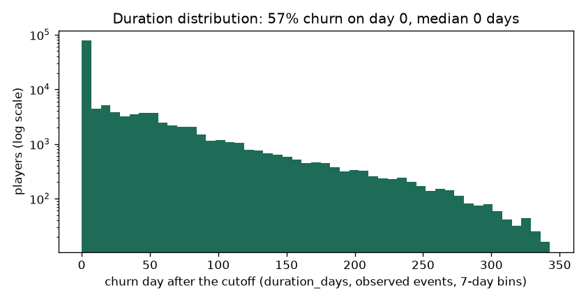
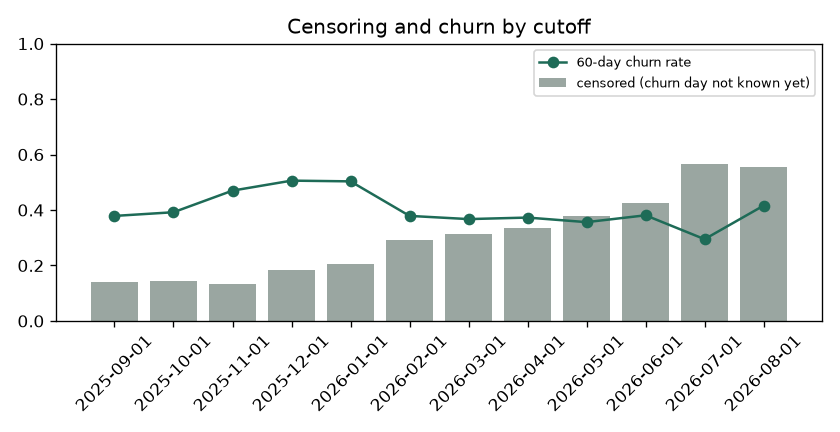

# EDA Summary vs Benchmark: Training Snapshot (brandId 64)

EDA stage 4 of the delivery plan: every statistic of the training snapshot next to its benchmark.

| | |
|---|---|
| Snapshot | `data/processed/train_dataset_64_2025-09-01_2025-10-01_2025-11-01_2025-12-01_2026-01-01_2026-02-01_2026-03-01_2026-04-01_2026-05-01_2026-06-01_2026-07-01_2026-08-01_1791444771.parquet` |
| Benchmark | `data/processed/train_dataset_64_2025-09-01_2025-10-01_2025-11-01_2025-12-01_2026-01-01_2026-02-01_2026-03-01_2026-04-01_2026-05-01_2026-06-01_2026-07-01_2026-08-01_1791435105.parquet` (the previous dataset of the brand) |
| Status | 0 critical, 0 warn, 87 ok |

Thresholds: row counts and null shares as in `configs/eda_alerts.yaml` (row count +-20% warn, +-50% critical; null share +5 / +20 points; PSI 0.10 / 0.25); a label rate that moves more than 5 points is a warning. Medians are in real units (days, EUR, counts).

## 1. Snapshot, Labels and Durations

| metric | current | benchmark | delta | status |
|---|---|---|---|---|
| rows | 180,122 | 180,122 | 0 | ok |
| players | 71,565 | 71,565 | 0 | ok |
| cutoffs | 12 | 12 | 0 | info |
| rows_per_cutoff | 15,010 | 15,010 | 0 | ok |
| churn_rate_60d | 0.409 | 0.409 | 0 | ok |
| churn_within_7d_rate | 0.439 | 0.439 | 0 | ok |
| churn_within_14d_rate | 0.467 | 0.467 | 0 | ok |
| churn_within_30d_rate | 0.524 | 0.524 | 0 | ok |
| event_rate | 0.720 | 0.720 | 0 | ok |
| censoring_rate | 0.280 | 0.280 | 0 | ok |
| duration_day0_share | 0.568 | 0.568 | 0 | info |
| duration_p50_days | 0 | 0 | 0 | info |
| duration_p75_days | 39 | 39 | 0 | info |
| duration_p90_days | 93 | 93 | 0 | info |
| duration_max_days | 340 | 340 | 0 | info |

## 2. Censoring and Duration Distribution

`duration_days` is the day the churn starts after the cutoff (0 = no bet in the next 60 days); a player is censored when the 60-day silence that would confirm it does not fit in the data yet. Censoring grows for recent cutoffs, which have less data after them.

| cutoff_date | rows | churn_rate_60d | churn_within_7d_rate | churn_within_14d_rate | churn_within_30d_rate | censoring_rate | median_churn_day |
|---|---|---|---|---|---|---|---|
| 2025-09-01 | 18433 | 0.379 | 0.405 | 0.424 | 0.471 | 0.140 | 16 |
| 2025-10-01 | 19279 | 0.392 | 0.428 | 0.451 | 0.521 | 0.143 | 8 |
| 2025-11-01 | 22163 | 0.470 | 0.514 | 0.564 | 0.648 | 0.132 | 0 |
| 2025-12-01 | 17727 | 0.506 | 0.531 | 0.547 | 0.605 | 0.182 | 0 |
| 2026-01-01 | 14569 | 0.503 | 0.532 | 0.549 | 0.588 | 0.205 | 0 |
| 2026-02-01 | 11878 | 0.379 | 0.403 | 0.431 | 0.476 | 0.293 | 0 |
| 2026-03-01 | 12622 | 0.367 | 0.397 | 0.425 | 0.474 | 0.313 | 0 |
| 2026-04-01 | 13187 | 0.373 | 0.396 | 0.420 | 0.477 | 0.337 | 0 |
| 2026-05-01 | 12823 | 0.356 | 0.388 | 0.419 | 0.490 | 0.379 | 0 |
| 2026-06-01 | 12982 | 0.381 | 0.414 | 0.436 | 0.469 | 0.425 | 0 |
| 2026-07-01 | 10463 | 0.295 | 0.320 | 0.359 | 0.414 | 0.567 | 0 |
| 2026-08-01 | 13996 | 0.416 | <NA> | <NA> | <NA> | 0.556 | 0 |

## 3. Features

No feature flagged against the benchmark.

| feature | null share | null share, benchmark | median | PSI |
|---|---|---|---|---|
| days_since_last_bet | 0 | 0 | 8 | 0 |
| days_since_last_deposit | 0.648 | 0.648 | 15 | 0 |
| active_days_l7d | 0 | 0 | 0 | 0 |
| active_days_l30d | 0 | 0 | 2.000 | 0 |
| active_days_l90d | 0 | 0 | 6 | 0 |
| bets_l7d | 0 | 0 | 0 | 0 |
| bets_l30d | 0 | 0 | 498 | 0 |
| sessions_l7d | 0 | 0 | 0 | 0 |
| sessions_l30d | 0 | 0 | 3 | 0 |
| n_deposit_days_7d | 0.648 | 0.648 | 0 | 0 |
| n_deposit_days_30d | 0.648 | 0.648 | 1 | 0 |
| wagered_eur_l7d | 0 | 0 | 0 | 0 |
| wagered_eur_l30d | 0 | 0 | 191 | 0 |
| wagered_eur_l90d | 0 | 0 | 592 | 0 |
| net_loss_7d | 0 | 0 | 0 | 0 |
| ggr_eur_l30d | 0 | 0 | 18.405 | 0 |
| deposits_eur_l30d | 0.648 | 0.648 | 37.531 | 0 |
| withdrawals_30d_share | 0.765 | 0.765 | 0 | 0 |
| prior_wagered_eur_l7d | 0 | 0 | 0 | 0 |
| prior_active_days_l7d | 0 | 0 | 0 | 0 |
| prior_ggr_eur_l30d | 0 | 0 | 0 | 0 |
| wagered_trend_7 | 0 | 0 | 1 | 0 |
| heavy_loss_multiple | 0.135 | 0.135 | 0 | 0 |
| deposits_30_vs_prior30 | 0.866 | 0.866 | 0.766 | 0 |
| days_since_first_bet | 0 | 0 | 150 | 0 |
| prior_dormancy_spells_14d | 0 | 0 | 1 | 0 |
| days_since_last_return | 0 | 0 | 45 | 0 |
| engagement_score | 0 | 0 | 5.282 | 0 |
| games_breadth_30d | 0 | 0 | 3 | 0 |
| games_breadth_ratio | 0 | 0 | 2 | 0 |
| bonus_stake_share_30d | 0.000 | 0.000 | 0.114 | 0 |
| losing_streak | 0 | 0 | 2 | 0 |
| avg_bet_eur_l30d | 0 | 0 | 0.309 | 0 |
| night_play_index | 0 | 0 | 0 | 0 |
| deposited_within_3d | 0.648 | 0.648 | 0 | 0 |
| deposited_within_7d | 0.648 | 0.648 | 0 | 0 |
| deposited_within_14d | 0.648 | 0.648 | 0 | 0 |
| deposit_frequency_score | 0.648 | 0.648 | 0 | 0 |
| failed_deposits_14d | 0.648 | 0.648 | 0 | 0 |

Generated by `eda/summary.py` (`make eda-summary`; the pipeline runs it after building the dataset). Table: `data/03_output/eda_summary/brand64/summary.csv`.
