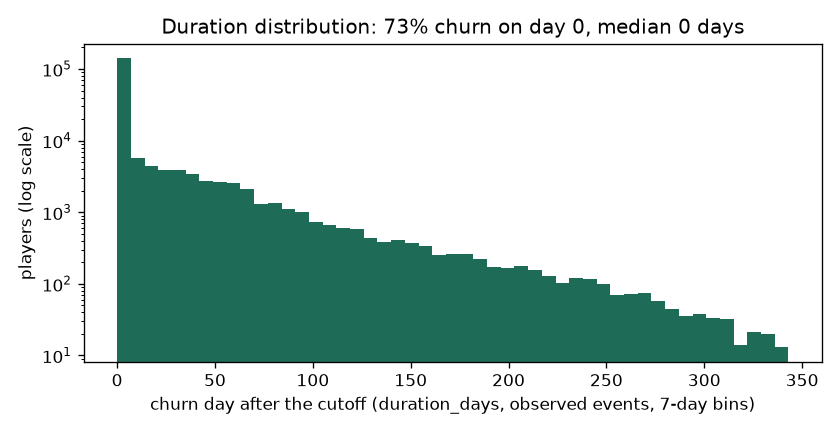
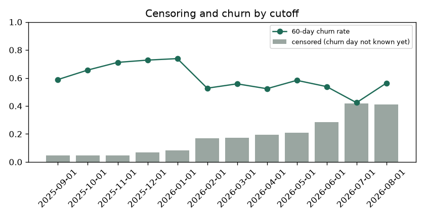

# EDA Summary vs Benchmark: Training Snapshot (brandId 72)

EDA stage 4 of the delivery plan: every statistic of the training snapshot next to its benchmark.

| | |
|---|---|
| Snapshot | `data/processed/train_dataset_72_2025-09-01_2025-10-01_2025-11-01_2025-12-01_2026-01-01_2026-02-01_2026-03-01_2026-04-01_2026-05-01_2026-06-01_2026-07-01_2026-08-01_1791546897.parquet` |
| Benchmark | `none (first dataset)` (the previous dataset of the brand) |
| Status | 0 critical, 0 warn, 0 ok |

Thresholds: row counts and null shares as in `configs/eda_alerts.yaml` (row count +-20% warn, +-50% critical; null share +5 / +20 points; PSI 0.10 / 0.25); a label rate that moves more than 5 points is a warning. Medians are in real units (days, EUR, counts).

## 1. Snapshot, Labels and Durations

| metric | current | benchmark | delta | status |
|---|---|---|---|---|
| rows | 218,525 |  |  | new |
| players | 132,202 |  |  | new |
| cutoffs | 12 |  |  | new |
| rows_per_cutoff | 18,210 |  |  | new |
| churn_rate_60d | 0.619 |  |  | new |
| churn_within_7d_rate | 0.662 |  |  | new |
| churn_within_14d_rate | 0.688 |  |  | new |
| churn_within_30d_rate | 0.735 |  |  | new |
| event_rate | 0.850 |  |  | new |
| censoring_rate | 0.150 |  |  | new |
| duration_day0_share | 0.728 |  |  | new |
| duration_p50_days | 0 |  |  | new |
| duration_p75_days | 4 |  |  | new |
| duration_p90_days | 51 |  |  | new |
| duration_max_days | 340 |  |  | new |

## 2. Censoring and Duration Distribution

`duration_days` is the day the churn starts after the cutoff (0 = no bet in the next 60 days); a player is censored when the 60-day silence that would confirm it does not fit in the data yet. Censoring grows for recent cutoffs, which have less data after them.

| cutoff_date | rows | churn_rate_60d | churn_within_7d_rate | churn_within_14d_rate | churn_within_30d_rate | censoring_rate | median_churn_day |
|---|---|---|---|---|---|---|---|
| 2025-09-01 | 22572 | 0.589 | 0.622 | 0.661 | 0.711 | 0.048 | 0 |
| 2025-10-01 | 26741 | 0.657 | 0.692 | 0.718 | 0.768 | 0.046 | 0 |
| 2025-11-01 | 29996 | 0.712 | 0.773 | 0.800 | 0.852 | 0.045 | 0 |
| 2025-12-01 | 23018 | 0.728 | 0.754 | 0.778 | 0.818 | 0.067 | 0 |
| 2026-01-01 | 19595 | 0.739 | 0.763 | 0.778 | 0.814 | 0.082 | 0 |
| 2026-02-01 | 11613 | 0.527 | 0.566 | 0.592 | 0.639 | 0.168 | 0 |
| 2026-03-01 | 13658 | 0.558 | 0.587 | 0.610 | 0.654 | 0.172 | 0 |
| 2026-04-01 | 13830 | 0.523 | 0.605 | 0.626 | 0.671 | 0.193 | 0 |
| 2026-05-01 | 15748 | 0.583 | 0.616 | 0.644 | 0.690 | 0.211 | 0 |
| 2026-06-01 | 13054 | 0.539 | 0.567 | 0.589 | 0.625 | 0.286 | 0 |
| 2026-07-01 | 11452 | 0.424 | 0.460 | 0.489 | 0.560 | 0.419 | 0 |
| 2026-08-01 | 17248 | 0.563 | <NA> | <NA> | <NA> | 0.409 | 0 |

## 3. Features

No feature flagged against the benchmark.

| feature | null share | null share, benchmark | median | PSI |
|---|---|---|---|---|
| days_since_last_bet | 0 |  | 10 |  |
| days_since_last_deposit | 0.674 |  | 20 |  |
| active_days_l7d | 0 |  | 0 |  |
| active_days_l30d | 0 |  | 1.000 |  |
| active_days_l90d | 0 |  | 2 |  |
| bets_l7d | 0 |  | 0 |  |
| bets_l30d | 0 |  | 195 |  |
| sessions_l7d | 0 |  | 0 |  |
| sessions_l30d | 0 |  | 2 |  |
| n_deposit_days_7d | 0.674 |  | 0 |  |
| n_deposit_days_30d | 0.674 |  | 1 |  |
| wagered_eur_l7d | 0 |  | 0 |  |
| wagered_eur_l30d | 0 |  | 68.627 |  |
| wagered_eur_l90d | 0 |  | 119 |  |
| net_loss_7d | 0 |  | 0 |  |
| ggr_eur_l30d | 0 |  | 10.300 |  |
| deposits_eur_l30d | 0.674 |  | 9.427 |  |
| withdrawals_30d_share | 0.820 |  | 0 |  |
| prior_wagered_eur_l7d | 0 |  | 0 |  |
| prior_active_days_l7d | 0 |  | 0 |  |
| prior_ggr_eur_l30d | 0 |  | 0 |  |
| wagered_trend_7 | 0 |  | 1 |  |
| heavy_loss_multiple | 0.117 |  | 0 |  |
| deposits_30_vs_prior30 | 0.922 |  | 0.721 |  |
| days_since_first_bet | 0 |  | 28 |  |
| prior_dormancy_spells_14d | 0 |  | 0 |  |
| days_since_last_return | 0 |  | 181 |  |
| engagement_score | 0 |  | 2.693 |  |
| games_breadth_30d | 0 |  | 2 |  |
| games_breadth_ratio | 0 |  | 2 |  |
| bonus_stake_share_30d | 0.000 |  | 0.428 |  |
| losing_streak | 0 |  | 1 |  |
| avg_bet_eur_l30d | 0 |  | 0.328 |  |
| night_play_index | 0 |  | 0 |  |
| deposited_within_3d | 0.674 |  | 0 |  |
| deposited_within_7d | 0.674 |  | 0 |  |
| deposited_within_14d | 0.674 |  | 0 |  |
| deposit_frequency_score | 0.674 |  | 0 |  |
| failed_deposits_14d | 0.674 |  | 0 |  |

Generated by `eda/summary.py` (`make eda-summary`; the pipeline runs it after building the dataset). Table: `data/03_output/eda_summary/brand72/summary.csv`.
