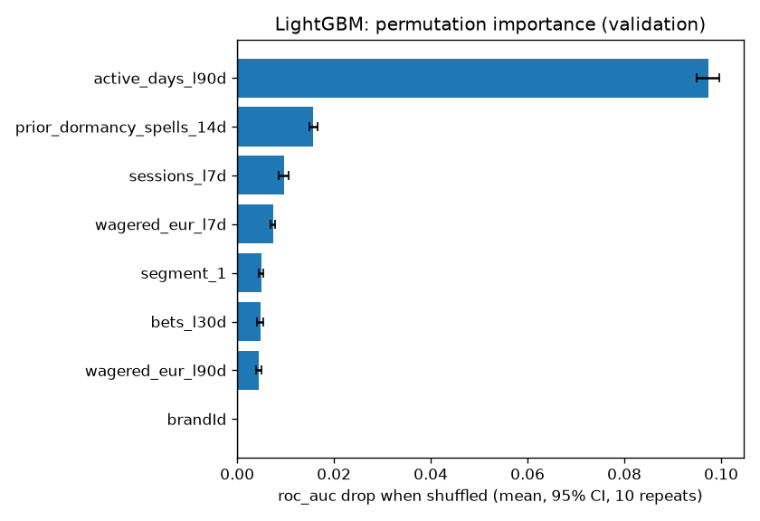
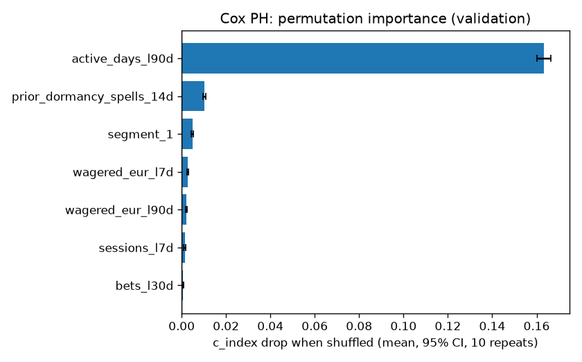
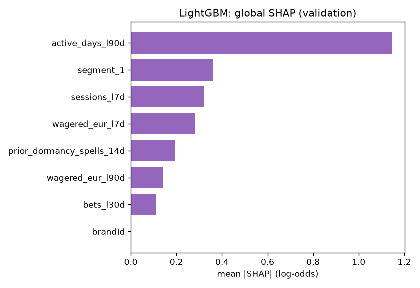
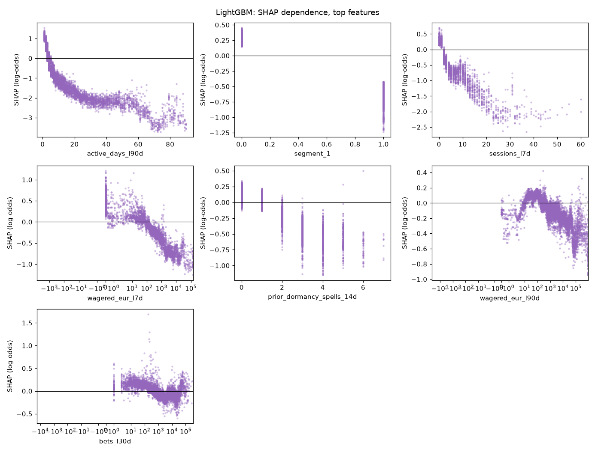
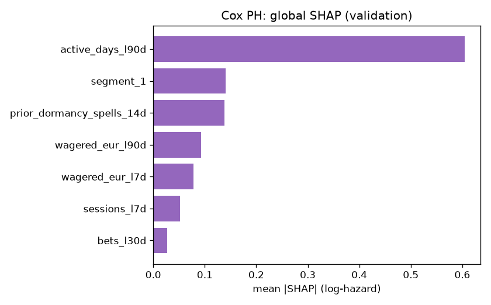
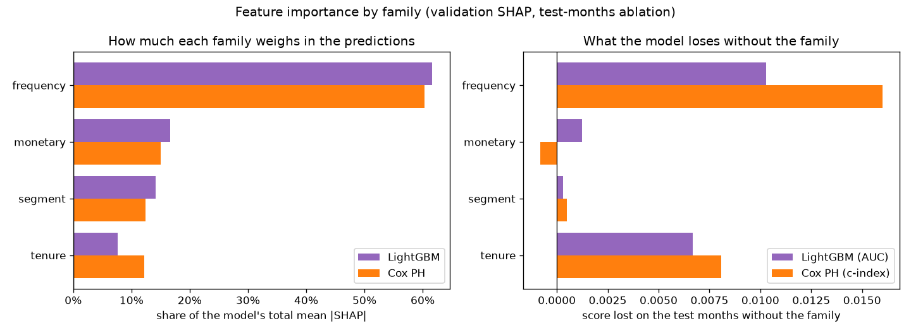

# Feature Importance v0 (brandId 14)

This document reports three importance measures together for the two baseline models. Gain-based importance alone overstates features with many distinct values and features that are correlated with others, so I do not use it here.

| Measure | Question it answers |
|---|---|
| Permutation importance | How much do the model's AUC and calibration fall when this feature is shuffled? |
| SHAP values | What does this feature do to each player's score, and in which direction? |
| Ablation by family | What is a whole family of features worth to the model? |

## 0. Models and Data

| | LightGBM | Cox PH |
|---|---|---|
| MLflow run | `lightgbm_classifier_brand14_1791433831` | `cox_ph_brand14_1791433854` |
| Target | `event_60d` (churn in the next 60 days) | `duration_days` + `event_observed` (churn day) |
| Features (after Stage 2 selection) | 8 | 7 |
| Test score (test months) | AUC 0.9095 | c-index 0.8909 |

- Dataset: `data/processed/train_dataset_14_2025-09-01_2025-10-01_2025-11-01_2025-12-01_2026-01-01_2026-02-01_2026-03-01_2026-04-01_2026-05-01_2026-06-01_2026-07-01_2026-08-01_1791433689.parquet`.
- Rows: train 118,098, validation 10,857, test 18,895. Validation month: 2026-06-01. Test months: 2026-07-01, 2026-08-01.
- Permutation importance and SHAP use the validation month, which the models were never fitted on (it is only used for early stopping, tuning and calibration).
- Brands: LightGBM gets `brandId` as a categorical feature and Cox PH is stratified by brand (one baseline per brand), so `brandId` never appears in the Cox tables. With one brand it is constant and its importance is 0. Ablation does not drop it: the model always adds it.
- Every number here comes from the models logged in those two runs. The script checks that they reproduce the logged test score before it measures anything.

## 1. Permutation Importance

I shuffle one feature at a time on the validation rows, 10 times, and measure how much the score changes. The interval is a 95% t-interval over the 10 shuffles, so it shows how stable the shuffle is, not the sampling error of the validation set.

- **AUC drop**: positive means the feature helps the model rank players.
- **Brier rise** and **ECE rise**: positive means the probabilities get less reliable. ECE is the expected calibration error over 10 equal-size bins.
- The probabilities are the ones the model delivers: isotonic-calibrated.

### LightGBM

| feature | family | AUC drop [95% CI] | Brier rise [95% CI] | ECE rise [95% CI] |
|---|---|---|---|---|
| active_days_l90d | frequency | 0.0973 [0.0949, 0.0997] | 0.0647 [0.0634, 0.0660] | 0.0614 [0.0590, 0.0638] |
| prior_dormancy_spells_14d | tenure | 0.0157 [0.0148, 0.0165] | 0.0091 [0.0088, 0.0095] | 0.0092 [0.0078, 0.0106] |
| sessions_l7d | frequency | 0.0096 [0.0086, 0.0107] | 0.0062 [0.0059, 0.0065] | 0.0192 [0.0181, 0.0202] |
| wagered_eur_l7d | monetary | 0.0074 [0.0069, 0.0078] | 0.0045 [0.0042, 0.0047] | 0.0103 [0.0095, 0.0112] |
| segment_1 | segment | 0.0049 [0.0044, 0.0055] | 0.0038 [0.0035, 0.0042] | 0.0129 [0.0123, 0.0136] |
| bets_l30d | frequency | 0.0048 [0.0040, 0.0055] | 0.0015 [0.0014, 0.0017] | 0.0050 [0.0035, 0.0064] |
| wagered_eur_l90d | monetary | 0.0045 [0.0039, 0.0051] | 0.0013 [0.0012, 0.0015] | 0.0121 [0.0108, 0.0134] |
| brandId | other | 0.0000 [0.0000, 0.0000] | 0.0000 [0.0000, 0.0000] | 0.0000 [0.0000, 0.0000] |

The delivery plan keeps a feature in the served model only if its permutation-importance interval excludes zero. Every LightGBM feature passes this rule.

### Cox PH

The Cox model gives a risk ranking, not a probability, so only the c-index is measured.

| feature | family | c-index drop [95% CI] |
|---|---|---|
| active_days_l90d | frequency | 0.1633 [0.1602, 0.1665] |
| prior_dormancy_spells_14d | tenure | 0.0103 [0.0097, 0.0108] |
| segment_1 | segment | 0.0048 [0.0044, 0.0053] |
| wagered_eur_l7d | monetary | 0.0029 [0.0025, 0.0032] |
| wagered_eur_l90d | monetary | 0.0021 [0.0017, 0.0025] |
| sessions_l7d | frequency | 0.0014 [0.0010, 0.0018] |
| bets_l30d | frequency | 0.0006 [0.0004, 0.0008] |

## 2. SHAP Values

SHAP splits each player's score into one part per feature. The parts add up to the score.

- **LightGBM**: exact TreeSHAP values from LightGBM itself (`pred_contrib=True`, the same algorithm as `shap.TreeExplainer`), in log-odds of churn.
- **Cox PH**: the model is linear, so the exact SHAP value is `beta * (x - training mean)`, in log-hazard. Positive means a higher risk of churning sooner.
- **Direction** is the sign of the rank correlation (`rank_corr`) between the feature value and its SHAP value. Under 0.5 in absolute value one direction would mislead, so it says "non-monotonic" and the dependence plot shows the real shape.

### LightGBM

| feature | family | mean_abs_shap | rank_corr | direction |
|---|---|---|---|---|
| active_days_l90d | frequency | 1.1449 | -0.9583 | higher value, lower churn risk |
| segment_1 | segment | 0.3619 | -0.7982 | higher value, lower churn risk |
| sessions_l7d | frequency | 0.3190 | -0.7842 | higher value, lower churn risk |
| wagered_eur_l7d | monetary | 0.2829 | -0.8191 | higher value, lower churn risk |
| prior_dormancy_spells_14d | tenure | 0.1940 | -0.8456 | higher value, lower churn risk |
| wagered_eur_l90d | monetary | 0.1426 | -0.7767 | higher value, lower churn risk |
| bets_l30d | frequency | 0.1096 | -0.7396 | higher value, lower churn risk |
| brandId | other | 0.0000 |  | categorical (brand) |

Dependence plots for the top 8 features (all the features the model uses). The x axis is in real units (days, EUR, counts), not on the sign-log scale. Each dot is one validation player.

### Cox PH

| feature | family | mean_abs_shap | rank_corr | direction |
|---|---|---|---|---|
| active_days_l90d | frequency | 0.6050 | -1.0000 | higher value, lower churn risk |
| segment_1 | segment | 0.1406 | -1.0000 | higher value, lower churn risk |
| prior_dormancy_spells_14d | tenure | 0.1384 | -1.0000 | higher value, lower churn risk |
| wagered_eur_l90d | monetary | 0.0924 | -1.0000 | higher value, lower churn risk |
| wagered_eur_l7d | monetary | 0.0785 | -1.0000 | higher value, lower churn risk |
| sessions_l7d | frequency | 0.0525 | -1.0000 | higher value, lower churn risk |
| bets_l30d | frequency | 0.0268 | -1.0000 | higher value, lower churn risk |

A dependence plot for a linear model is a straight line with slope `beta`, so I do not draw it. The hazard ratios are in `hazard_ratios.csv` in the Cox MLflow run.

## 3. Importance by Family

How much each group of features matters, with two measures side by side. **SHAP share**: the family's part of the model's total mean |SHAP| on the validation rows, so how much it weighs in the predictions. **Score lost**: what the model loses on the test months when the whole family is removed and the model is retrained, so what it adds that the other families cannot replace. A family can weigh a lot and still lose little when removed, if other families carry the same information.

| family | lightgbm_shap_share | cox_shap_share | lightgbm_auc_lost | cox_c_index_lost |
|---|---|---|---|---|
| frequency | 0.6159 | 0.6033 | 0.0103 | 0.0160 |
| monetary | 0.1665 | 0.1507 | 0.0013 | -0.0008 |
| segment | 0.1417 | 0.1240 | 0.0003 | 0.0005 |
| tenure | 0.0759 | 0.1220 | 0.0067 | 0.0081 |

## 4. Ablation by Family

I retrain the model without every feature of one family and compare it with the full model (same features otherwise, same parameters, same rows). A negative delta means the family helps. A family with no feature in the model is left empty.

Full model: LightGBM AUC valid 0.8985, test 0.9095. Cox c-index valid 0.8725, test 0.8909.

| family | LightGBM features | LightGBM AUC delta, valid | LightGBM AUC delta, test | Cox features | Cox c-index delta, valid | Cox c-index delta, test |
|---|---|---|---|---|---|---|
| recency |  |  |  |  |  |  |
| frequency | active_days_l90d, sessions_l7d, bets_l30d | -0.0096 | -0.0103 | active_days_l90d, sessions_l7d, bets_l30d | -0.0145 | -0.0160 |
| monetary | wagered_eur_l90d, wagered_eur_l7d | -0.0009 | -0.0013 | wagered_eur_l90d, wagered_eur_l7d | 0.0006 | 0.0008 |
| lag |  |  |  |  |  |  |
| trend |  |  |  |  |  |  |
| tenure | prior_dormancy_spells_14d | -0.0049 | -0.0067 | prior_dormancy_spells_14d | -0.0061 | -0.0081 |
| mix |  |  |  |  |  |  |
| deposit |  |  |  |  |  |  |
| segment | segment_1 | -0.0000 | -0.0003 | segment_1 | 0.0000 | -0.0005 |

The most valuable family on the test months is **frequency** for LightGBM (AUC -0.0103 without it) and **frequency** for Cox (c-index -0.0160 without it).

## 5. Known Limits

- **The Cox test months only have churn on days 0 to 37.** A churn day can only be confirmed when the 60 days after it are in the data, so on the test months the c-index mostly measures "who is already gone", not "which day".
- **The intervals only cover the shuffle.** A different validation sample would move the numbers more than the intervals show.
- **Correlated features share credit.** Stage 2 already removed pairs over 0.95, but features from the same family (for example `active_days_l30d` and `active_days_l90d`) can still hide each other in permutation importance. Ablation by family shows the joint value.

Generated by `src/models/feature_importance.py` (`make importance`). The figures and tables are in `data/03_output/feature_importance/brand14/` and in the `feature_importance/` folder of both MLflow runs.
