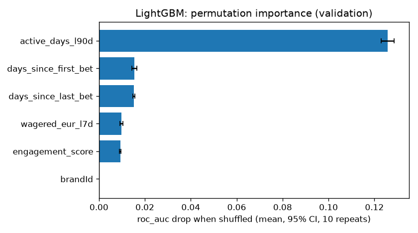
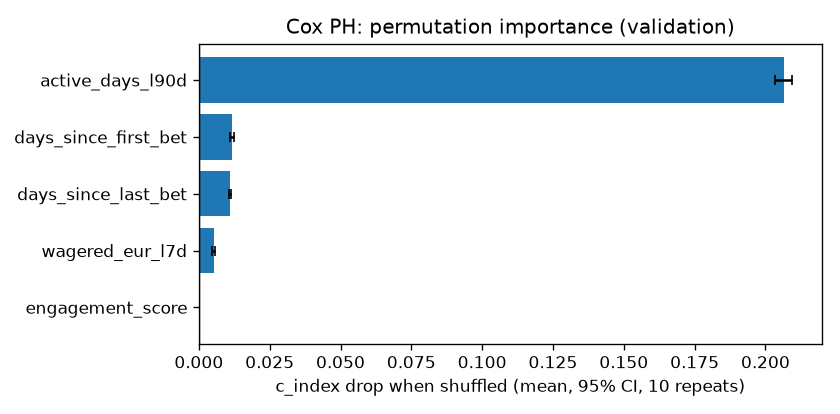
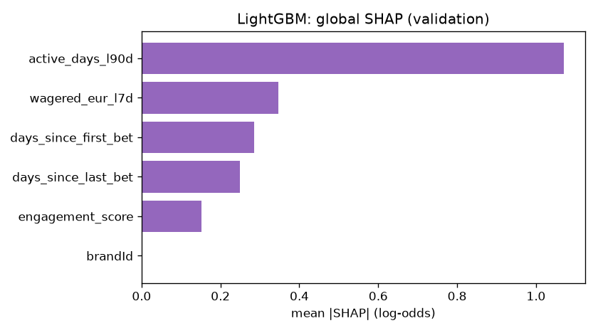
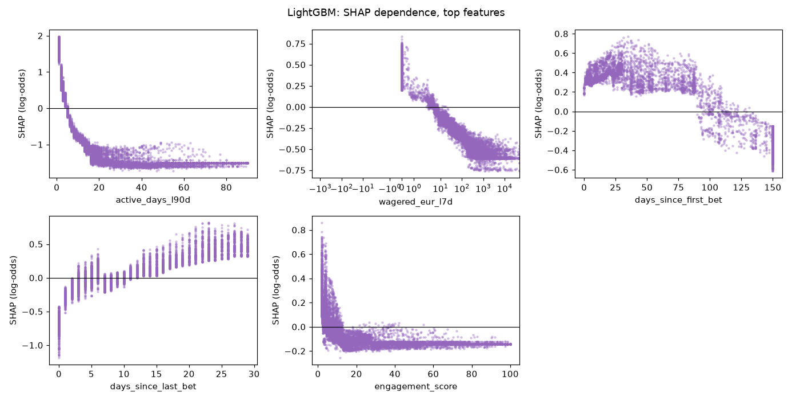
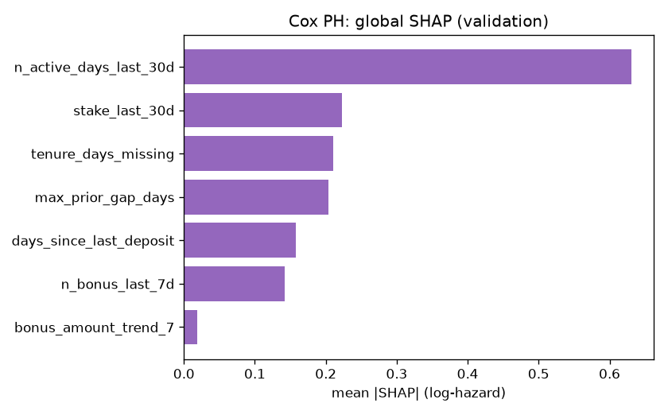
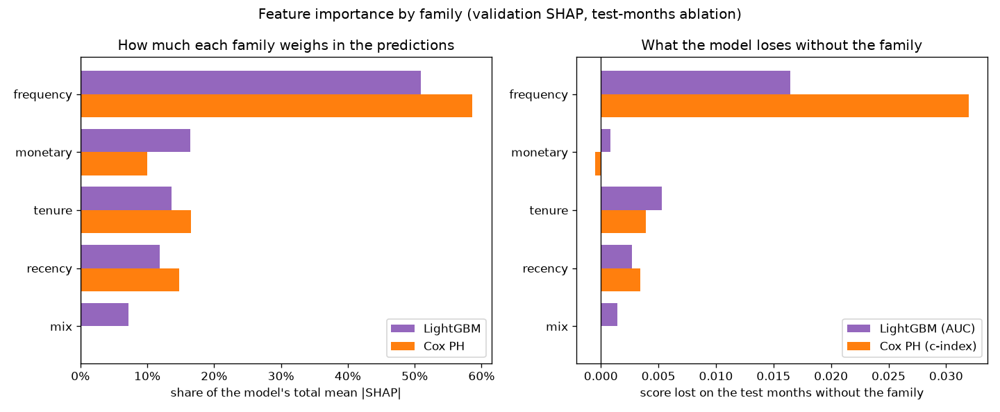

# Feature Importance v0 (brandId 64)

This document reports three importance measures together for the two baseline models. Gain-based importance alone overstates features with many distinct values and features that are correlated with others, so I do not use it here.

| Measure | Question it answers |
|---|---|
| Permutation importance | How much do the model's AUC and calibration fall when this feature is shuffled? |
| SHAP values | What does this feature do to each player's score, and in which direction? |
| Ablation by family | What is a whole family of features worth to the model? |

## 0. Models and Data

| | LightGBM | Cox PH |
|---|---|---|
| MLflow run | `lightgbm_classifier_brand64_1791444922` | `cox_ph_brand64_1791444950` |
| Target | `event_60d` (churn in the next 60 days) | `duration_days` + `event_observed` (churn day) |
| Features (after Stage 2 selection) | 6 | 5 |
| Test score (test months) | AUC 0.8950 | c-index 0.8685 |

- Dataset: `data/processed/train_dataset_64_2025-09-01_2025-10-01_2025-11-01_2025-12-01_2026-01-01_2026-02-01_2026-03-01_2026-04-01_2026-05-01_2026-06-01_2026-07-01_2026-08-01_1791444771.parquet`.
- Rows: train 142,681, validation 12,982, test 24,459. Validation month: 2026-06-01. Test months: 2026-07-01, 2026-08-01.
- Permutation importance and SHAP use the validation month, which the models were never fitted on (it is only used for early stopping, tuning and calibration).
- Brands: LightGBM gets `brandId` as a categorical feature and Cox PH is stratified by brand (one baseline per brand), so `brandId` never appears in the Cox tables. With one brand it is constant and its importance is 0. Ablation does not drop it: the model always adds it.
- Every number here comes from the models logged in those two runs. The script checks that they reproduce the logged test score before it measures anything.

## 1. Permutation Importance

I shuffle one feature at a time on the validation rows, 10 times, and measure how much the score changes. The interval is a 95% t-interval over the 10 shuffles, so it shows how stable the shuffle is, not the sampling error of the validation set.

- **AUC drop**: positive means the feature helps the model rank players.
- **Brier rise** and **ECE rise**: positive means the probabilities get less reliable. ECE is the expected calibration error over 10 equal-size bins.
- The probabilities are the ones the model delivers: isotonic-calibrated.

### LightGBM

| feature | family | AUC drop [95% CI] | Brier rise [95% CI] | ECE rise [95% CI] |
|---|---|---|---|---|
| active_days_l90d | frequency | 0.1257 [0.1228, 0.1287] | 0.0605 [0.0592, 0.0618] | 0.0608 [0.0588, 0.0627] |
| days_since_first_bet | tenure | 0.0154 [0.0144, 0.0164] | 0.0087 [0.0082, 0.0092] | 0.0156 [0.0138, 0.0175] |
| days_since_last_bet | recency | 0.0153 [0.0149, 0.0156] | 0.0086 [0.0083, 0.0088] | 0.0107 [0.0092, 0.0122] |
| wagered_eur_l7d | monetary | 0.0098 [0.0092, 0.0104] | 0.0056 [0.0053, 0.0059] | 0.0139 [0.0125, 0.0152] |
| engagement_score | mix | 0.0092 [0.0089, 0.0096] | 0.0056 [0.0054, 0.0058] | 0.0218 [0.0209, 0.0226] |
| brandId | other | 0.0000 [0.0000, 0.0000] | 0.0000 [0.0000, 0.0000] | 0.0000 [0.0000, 0.0000] |

The delivery plan keeps a feature in the served model only if its permutation-importance interval excludes zero. Every LightGBM feature passes this rule.

### Cox PH

The Cox model gives a risk ranking, not a probability, so only the c-index is measured.

| feature | family | c-index drop [95% CI] |
|---|---|---|
| active_days_l90d | frequency | 0.2065 [0.2035, 0.2095] |
| days_since_first_bet | tenure | 0.0117 [0.0110, 0.0124] |
| days_since_last_bet | recency | 0.0110 [0.0106, 0.0113] |
| wagered_eur_l7d | monetary | 0.0052 [0.0048, 0.0056] |
| engagement_score | mix | 0.0000 [0.0000, 0.0000] |

## 2. SHAP Values

SHAP splits each player's score into one part per feature. The parts add up to the score.

- **LightGBM**: exact TreeSHAP values from LightGBM itself (`pred_contrib=True`, the same algorithm as `shap.TreeExplainer`), in log-odds of churn.
- **Cox PH**: the model is linear, so the exact SHAP value is `beta * (x - training mean)`, in log-hazard. Positive means a higher risk of churning sooner.
- **Direction** is the sign of the rank correlation (`rank_corr`) between the feature value and its SHAP value. Under 0.5 in absolute value one direction would mislead, so it says "non-monotonic" and the dependence plot shows the real shape.

### LightGBM

| feature | family | mean_abs_shap | rank_corr | direction |
|---|---|---|---|---|
| active_days_l90d | frequency | 1.0711 | -0.9761 | higher value, lower churn risk |
| wagered_eur_l7d | monetary | 0.3462 | -0.9085 | higher value, lower churn risk |
| days_since_first_bet | tenure | 0.2863 | -0.7923 | higher value, lower churn risk |
| days_since_last_bet | recency | 0.2494 | 0.9308 | higher value, higher churn risk |
| engagement_score | mix | 0.1522 | -0.8913 | higher value, lower churn risk |
| brandId | other | 0.0000 |  | categorical (brand) |

Dependence plots for the top 6 features (all the features the model uses). The x axis is in real units (days, EUR, counts), not on the sign-log scale. Each dot is one validation player.

### Cox PH

| feature | family | mean_abs_shap | rank_corr | direction |
|---|---|---|---|---|
| active_days_l90d | frequency | 0.6103 | -1.0000 | higher value, lower churn risk |
| days_since_first_bet | tenure | 0.1725 | -1.0000 | higher value, lower churn risk |
| days_since_last_bet | recency | 0.1543 | 1.0000 | higher value, higher churn risk |
| wagered_eur_l7d | monetary | 0.1047 | -1.0000 | higher value, lower churn risk |
| engagement_score | mix | 0.0000 | -1.0000 | higher value, lower churn risk |

A dependence plot for a linear model is a straight line with slope `beta`, so I do not draw it. The hazard ratios are in `hazard_ratios.csv` in the Cox MLflow run.

## 3. Importance by Family

How much each group of features matters, with two measures side by side. **SHAP share**: the family's part of the model's total mean |SHAP| on the validation rows, so how much it weighs in the predictions. **Score lost**: what the model loses on the test months when the whole family is removed and the model is retrained, so what it adds that the other families cannot replace. A family can weigh a lot and still lose little when removed, if other families carry the same information.

| family | lightgbm_shap_share | cox_shap_share | lightgbm_auc_lost | cox_c_index_lost |
|---|---|---|---|---|
| frequency | 0.5088 | 0.5858 | 0.0165 | 0.0320 |
| monetary | 0.1644 | 0.1005 | 0.0008 | -0.0005 |
| tenure | 0.1360 | 0.1656 | 0.0053 | 0.0039 |
| recency | 0.1185 | 0.1481 | 0.0027 | 0.0034 |
| mix | 0.0723 | 0.0000 | 0.0015 | 0.0000 |

## 4. Ablation by Family

I retrain the model without every feature of one family and compare it with the full model (same features otherwise, same parameters, same rows). A negative delta means the family helps. A family with no feature in the model is left empty.

Full model: LightGBM AUC valid 0.8855, test 0.8950. Cox c-index valid 0.8396, test 0.8685.

| family | LightGBM features | LightGBM AUC delta, valid | LightGBM AUC delta, test | Cox features | Cox c-index delta, valid | Cox c-index delta, test |
|---|---|---|---|---|---|---|
| recency | days_since_last_bet | -0.0042 | -0.0027 | days_since_last_bet | -0.0017 | -0.0034 |
| frequency | active_days_l90d | -0.0121 | -0.0165 | active_days_l90d | -0.0281 | -0.0320 |
| monetary | wagered_eur_l7d | -0.0006 | -0.0008 | wagered_eur_l7d | -0.0003 | 0.0005 |
| lag |  |  |  |  |  |  |
| trend |  |  |  |  |  |  |
| tenure | days_since_first_bet | -0.0044 | -0.0053 | days_since_first_bet | -0.0026 | -0.0039 |
| mix | engagement_score | -0.0021 | -0.0015 | engagement_score | -0.0000 | -0.0000 |
| deposit |  |  |  |  |  |  |
| segment |  |  |  |  |  |  |

The most valuable family on the test months is **frequency** for LightGBM (AUC -0.0165 without it) and **frequency** for Cox (c-index -0.0320 without it).

## 5. Known Limits

- **The Cox test months only have churn on days 0 to 37.** A churn day can only be confirmed when the 60 days after it are in the data, so on the test months the c-index mostly measures "who is already gone", not "which day".
- **The intervals only cover the shuffle.** A different validation sample would move the numbers more than the intervals show.
- **Correlated features share credit.** Stage 2 already removed pairs over 0.95, but features from the same family (for example `active_days_l30d` and `active_days_l90d`) can still hide each other in permutation importance. Ablation by family shows the joint value.

Generated by `src/models/feature_importance.py` (`make importance`). The figures and tables are in `data/03_output/feature_importance/brand64/` and in the `feature_importance/` folder of both MLflow runs.
