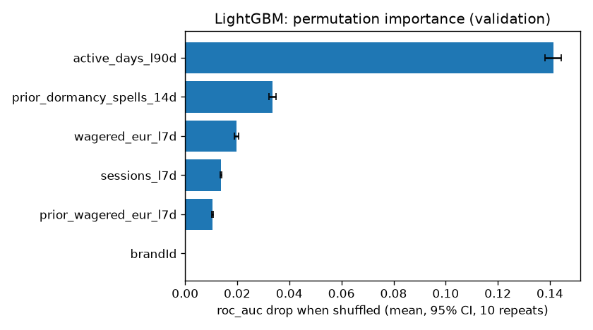
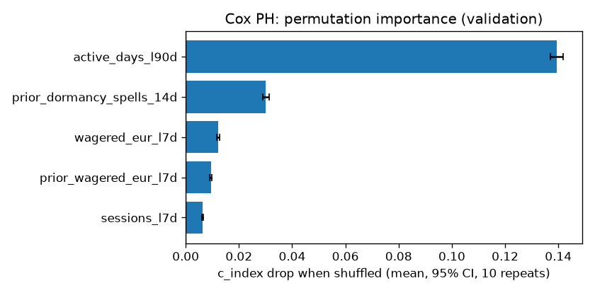
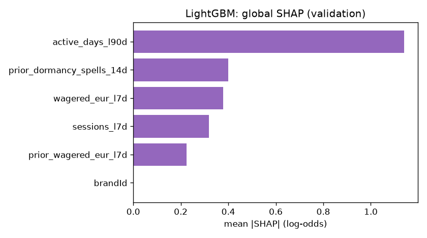
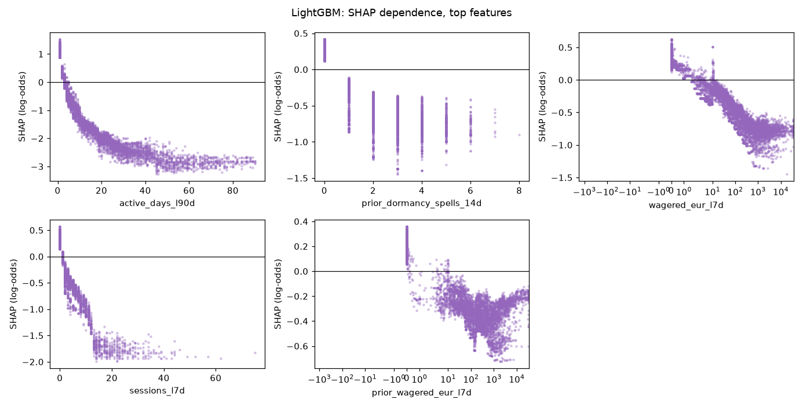
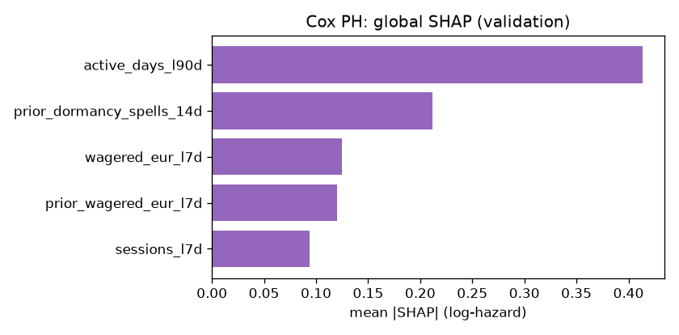
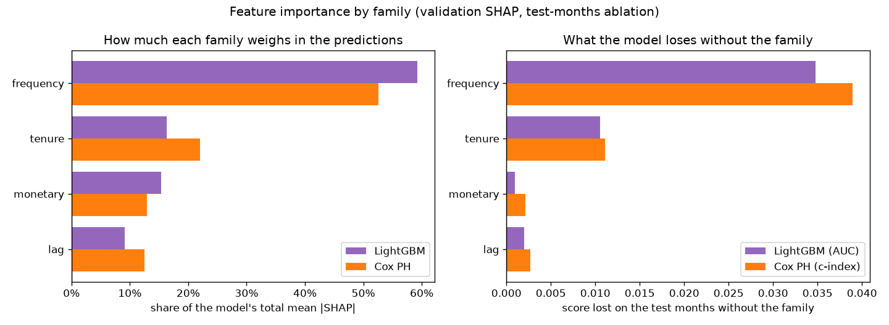

# Feature Importance v0 (brandId 72)

This document reports three importance measures together for the two baseline models. Gain-based importance alone overstates features with many distinct values and features that are correlated with others, so I do not use it here.

| Measure | Question it answers |
|---|---|
| Permutation importance | How much do the model's AUC and calibration fall when this feature is shuffled? |
| SHAP values | What does this feature do to each player's score, and in which direction? |
| Ablation by family | What is a whole family of features worth to the model? |

## 0. Models and Data

| | LightGBM | Cox PH |
|---|---|---|
| MLflow run | `lightgbm_classifier_brand72_1791547072` | `cox_ph_brand72_1791547100` |
| Target | `event_60d` (churn in the next 60 days) | `duration_days` + `event_observed` (churn day) |
| Features (after Stage 2 selection) | 6 | 5 |
| Test score (test months) | AUC 0.8697 | c-index 0.8489 |

- Dataset: `data/processed/train_dataset_72_2025-09-01_2025-10-01_2025-11-01_2025-12-01_2026-01-01_2026-02-01_2026-03-01_2026-04-01_2026-05-01_2026-06-01_2026-07-01_2026-08-01_1791546897.parquet`.
- Rows: train 176,771, validation 13,054, test 28,700. Validation month: 2026-06-01. Test months: 2026-07-01, 2026-08-01.
- Permutation importance and SHAP use the validation month, which the models were never fitted on (it is only used for early stopping, tuning and calibration).
- Brands: LightGBM gets `brandId` as a categorical feature and Cox PH is stratified by brand (one baseline per brand), so `brandId` never appears in the Cox tables. With one brand it is constant and its importance is 0. Ablation does not drop it: the model always adds it.
- Every number here comes from the models logged in those two runs. The script checks that they reproduce the logged test score before it measures anything.

## 1. Permutation Importance

I shuffle one feature at a time on the validation rows, 10 times, and measure how much the score changes. The interval is a 95% t-interval over the 10 shuffles, so it shows how stable the shuffle is, not the sampling error of the validation set.

- **AUC drop**: positive means the feature helps the model rank players.
- **Brier rise** and **ECE rise**: positive means the probabilities get less reliable. ECE is the expected calibration error over 10 equal-size bins.
- The probabilities are the ones the model delivers: isotonic-calibrated.

### LightGBM

| feature | family | AUC drop [95% CI] | Brier rise [95% CI] | ECE rise [95% CI] |
|---|---|---|---|---|
| active_days_l90d | frequency | 0.1412 [0.1381, 0.1444] | 0.0807 [0.0791, 0.0824] | 0.0736 [0.0706, 0.0766] |
| prior_dormancy_spells_14d | tenure | 0.0335 [0.0321, 0.0349] | 0.0171 [0.0166, 0.0177] | 0.0261 [0.0242, 0.0280] |
| wagered_eur_l7d | monetary | 0.0198 [0.0190, 0.0207] | 0.0129 [0.0125, 0.0133] | 0.0245 [0.0235, 0.0256] |
| sessions_l7d | frequency | 0.0139 [0.0136, 0.0142] | 0.0089 [0.0086, 0.0091] | 0.0200 [0.0195, 0.0205] |
| prior_wagered_eur_l7d | lag | 0.0105 [0.0101, 0.0109] | 0.0071 [0.0068, 0.0074] | 0.0111 [0.0101, 0.0121] |
| brandId | other | 0.0000 [0.0000, 0.0000] | 0.0000 [0.0000, 0.0000] | 0.0000 [0.0000, 0.0000] |

The delivery plan keeps a feature in the served model only if its permutation-importance interval excludes zero. Every LightGBM feature passes this rule.

### Cox PH

The Cox model gives a risk ranking, not a probability, so only the c-index is measured.

| feature | family | c-index drop [95% CI] |
|---|---|---|
| active_days_l90d | frequency | 0.1394 [0.1369, 0.1419] |
| prior_dormancy_spells_14d | tenure | 0.0301 [0.0290, 0.0313] |
| wagered_eur_l7d | monetary | 0.0122 [0.0118, 0.0127] |
| prior_wagered_eur_l7d | lag | 0.0095 [0.0091, 0.0099] |
| sessions_l7d | frequency | 0.0063 [0.0061, 0.0066] |

## 2. SHAP Values

SHAP splits each player's score into one part per feature. The parts add up to the score.

- **LightGBM**: exact TreeSHAP values from LightGBM itself (`pred_contrib=True`, the same algorithm as `shap.TreeExplainer`), in log-odds of churn.
- **Cox PH**: the model is linear, so the exact SHAP value is `beta * (x - training mean)`, in log-hazard. Positive means a higher risk of churning sooner.
- **Direction** is the sign of the rank correlation (`rank_corr`) between the feature value and its SHAP value. Under 0.5 in absolute value one direction would mislead, so it says "non-monotonic" and the dependence plot shows the real shape.

### LightGBM

| feature | family | mean_abs_shap | rank_corr | direction |
|---|---|---|---|---|
| active_days_l90d | frequency | 1.1410 | -0.9778 | higher value, lower churn risk |
| prior_dormancy_spells_14d | tenure | 0.4008 | -0.8956 | higher value, lower churn risk |
| wagered_eur_l7d | monetary | 0.3776 | -0.9026 | higher value, lower churn risk |
| sessions_l7d | frequency | 0.3193 | -0.9211 | higher value, lower churn risk |
| prior_wagered_eur_l7d | lag | 0.2243 | -0.8305 | higher value, lower churn risk |
| brandId | other | 0.0000 |  | categorical (brand) |

Dependence plots for the top 6 features (all the features the model uses). The x axis is in real units (days, EUR, counts), not on the sign-log scale. Each dot is one validation player.

### Cox PH

| feature | family | mean_abs_shap | rank_corr | direction |
|---|---|---|---|---|
| active_days_l90d | frequency | 0.4138 | -1.0000 | higher value, lower churn risk |
| prior_dormancy_spells_14d | tenure | 0.2121 | -1.0000 | higher value, lower churn risk |
| wagered_eur_l7d | monetary | 0.1248 | -1.0000 | higher value, lower churn risk |
| prior_wagered_eur_l7d | lag | 0.1202 | -1.0000 | higher value, lower churn risk |
| sessions_l7d | frequency | 0.0941 | -1.0000 | higher value, lower churn risk |

A dependence plot for a linear model is a straight line with slope `beta`, so I do not draw it. The hazard ratios are in `hazard_ratios.csv` in the Cox MLflow run.

## 3. Importance by Family

How much each group of features matters, with two measures side by side. **SHAP share**: the family's part of the model's total mean |SHAP| on the validation rows, so how much it weighs in the predictions. **Score lost**: what the model loses on the test months when the whole family is removed and the model is retrained, so what it adds that the other families cannot replace. A family can weigh a lot and still lose little when removed, if other families carry the same information.

| family | lightgbm_shap_share | cox_shap_share | lightgbm_auc_lost | cox_c_index_lost |
|---|---|---|---|---|
| frequency | 0.5929 | 0.5263 | 0.0348 | 0.0389 |
| tenure | 0.1627 | 0.2198 | 0.0105 | 0.0111 |
| monetary | 0.1533 | 0.1293 | 0.0010 | 0.0021 |
| lag | 0.0911 | 0.1246 | 0.0020 | 0.0027 |

## 4. Ablation by Family

I retrain the model without every feature of one family and compare it with the full model (same features otherwise, same parameters, same rows). A negative delta means the family helps. A family with no feature in the model is left empty.

Full model: LightGBM AUC valid 0.8934, test 0.8697. Cox c-index valid 0.8560, test 0.8489.

| family | LightGBM features | LightGBM AUC delta, valid | LightGBM AUC delta, test | Cox features | Cox c-index delta, valid | Cox c-index delta, test |
|---|---|---|---|---|---|---|
| recency |  |  |  |  |  |  |
| frequency | active_days_l90d, sessions_l7d | -0.0276 | -0.0348 | active_days_l90d, sessions_l7d | -0.0319 | -0.0389 |
| monetary | wagered_eur_l7d | -0.0030 | -0.0010 | wagered_eur_l7d | -0.0027 | -0.0021 |
| lag | prior_wagered_eur_l7d | -0.0038 | -0.0020 | prior_wagered_eur_l7d | -0.0032 | -0.0027 |
| trend |  |  |  |  |  |  |
| tenure | prior_dormancy_spells_14d | -0.0107 | -0.0105 | prior_dormancy_spells_14d | -0.0096 | -0.0111 |
| mix |  |  |  |  |  |  |
| deposit |  |  |  |  |  |  |
| segment |  |  |  |  |  |  |

The most valuable family on the test months is **frequency** for LightGBM (AUC -0.0348 without it) and **frequency** for Cox (c-index -0.0389 without it).

## 5. Known Limits

- **The Cox test months only have churn on days 0 to 37.** A churn day can only be confirmed when the 60 days after it are in the data, so on the test months the c-index mostly measures "who is already gone", not "which day".
- **The intervals only cover the shuffle.** A different validation sample would move the numbers more than the intervals show.
- **Correlated features share credit.** Stage 2 already removed pairs over 0.95, but features from the same family (for example `active_days_l30d` and `active_days_l90d`) can still hide each other in permutation importance. Ablation by family shows the joint value.

Generated by `src/models/feature_importance.py` (`make importance`). The figures and tables are in `data/03_output/feature_importance/brand72/` and in the `feature_importance/` folder of both MLflow runs.
