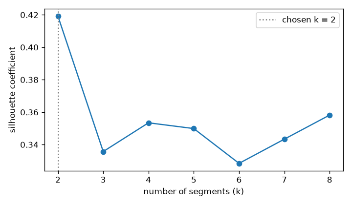
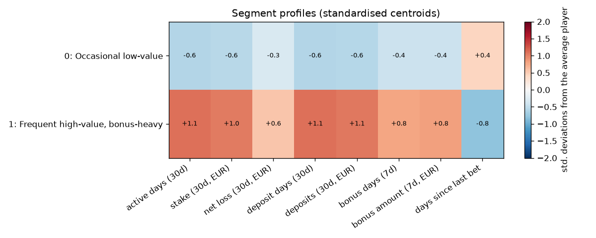

# Player Segments v0 (brandId=64)

I group players by how they behaved in the 30 days before the cutoff, with k-means. The segments are an **input feature** for the churn models, never the churn score: the score comes only from LightGBM (probability) and Cox PH (survival). Stage 2 selection decides whether a model keeps them.

## 1. Method

- **Rows**: the training months only (2026-07-18, 2026-07-27), 26,641 player snapshots. The test month (2026-08-05) is only assigned to a segment, never used to fit them.
- **Features** (the 30-day behaviour profile): `n_active_days_last_30d`, `stake_last_30d`, `net_loss_last_30d`, `n_deposit_last_30d`, `deposit_amount_last_30d`, `n_bonus_last_7d`, `bonus_amount_last_7d`, `days_since_last_active`. They are on the sign-log scale from `build_features.py` and then standardised (mean 0, std 1), so no feature dominates because of its units.
- **Model**: `kmeans` from `catalog/model_library_catalog.json` (`sklearn.cluster.KMeans`), 10 starts, seed 42.
- **Number of segments**: the k with the highest silhouette coefficient among [2, 3, 4, 5, 6, 7, 8]. Silhouette goes from -1 to 1: high means players are close to their own segment and far from the others. I measure it on a random sample of 10,000 rows, because it is slow on all of them.
- **Order**: segment 0 is the largest. In the models it is the reference, so they get `segment_1` (1 if the player is in that segment).

## 2. Choosing k

| k | silhouette | chosen |
|---|---|---|
| 2 | 0.4192 | yes |
| 3 | 0.3357 |  |
| 4 | 0.3534 |  |
| 5 | 0.3499 |  |
| 6 | 0.3284 |  |
| 7 | 0.3434 |  |
| 8 | 0.3582 |  |

**Chosen: k = 2** (silhouette 0.4192). The next best is k = 8 (0.3582). With k = 2 the split is mostly "engaged vs not engaged". A finer set of types scores a lower silhouette, so its groups would overlap more.

## 3. Player Types

Median values per segment, in real units (training months):

| segment | name | share | active days (30d) | stake (30d, EUR) | net loss (30d, EUR) | deposit days (30d) | deposits (30d, EUR) | bonus days (7d) | bonus amount (7d, EUR) | days since last bet |
|---|---|---|---|---|---|---|---|---|---|---|
| 0 | Occasional low-value | 65.1% | 1.00 | 0.00 | 0.00 | 0.00 | 0.00 | 0.00 | 0.00 | 9.00 |
| 1 | Frequent high-value, bonus-heavy | 34.9% | 9.00 | 2,347 | 169 | 6.00 | 384 | 2.00 | 9.31 | 1.00 |

How each segment differs from the average player (standardised centroid, top 3 features) and its churn rate. The average churn in the training months is 37.8%. The names come from simple rules on the centroid (activity, stake, recency, bonus use), so they stay the same when I rerun this.

| segment | name | what stands out | churn 60d, training months | churn 60d, test month |
|---|---|---|---|---|
| 0 | Occasional low-value | low deposit days (30d) (-0.6 sd), low active days (30d) (-0.6 sd), low deposits (30d, EUR) (-0.6 sd) | 54.9% | 58.9% |
| 1 | Frequent high-value, bonus-heavy | high deposit days (30d) (+1.1 sd), high active days (30d) (+1.1 sd), high deposits (30d, EUR) (+1.1 sd) | 6.0% | 7.6% |

## 4. Stability Over Time

Share of players in each segment, per cutoff (the last one is the test month):

| cutoff | segment 0 | segment 1 |
|---|---|---|
| 2026-07-18 | 63.8% | 36.2% |
| 2026-07-27 | 66.2% | 33.8% |
| 2026-08-05 | 68.6% | 31.4% |

## 5. Use in the Models

Stage 2 decision for the segment features in the latest training run of each model (read from MLflow when this file is generated, so run `make train-baseline` before `make segments`):

- **lightgbm_classifier** (`lightgbm_classifier_1791203911`): `segment_1` dropped at step 4 (permutation importance 0.0004, outside the top 7).
- **cox_ph** (`cox_ph_1791203962`): `segment_1` dropped at step 4 (permutation importance 0.0008, outside the top 4).

When the segment is dropped at step 4, the model already gets the same information from the raw features it is built from (active days, stake, deposits). The segment is still useful to describe players: `make score` adds it to every player's score.

## 6. Known Limits

- **k-means looks for round groups of similar size.** Real player types can be long or uneven shapes; a low silhouette means the groups overlap a lot and the borders between them are soft.
- **The churn rates are descriptive.** They show that segments differ, not that the segment causes the churn.
- **A small segment can be dropped by Stage 2** as near-zero variance, and the models can ignore the segments when the raw features already carry the same information. `feature_selection.csv` in each MLflow run says what happened.

Generated by `src/models/segments.py` (`make segments`) from `data/processed/train_dataset_64_2026-07-18_2026-07-27_2026-08-05_1791191780.parquet`.
