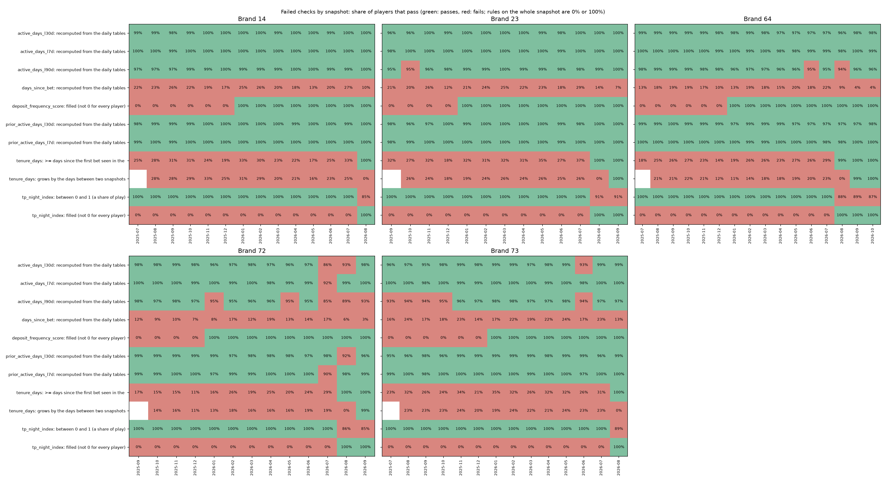
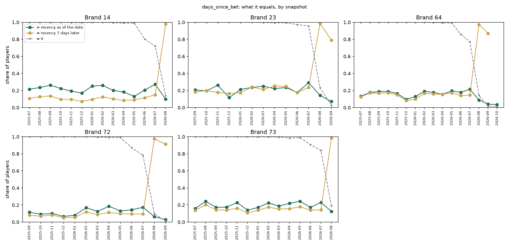

# Signal Validation: gld_player_signals_daily

- **What**: every column of the signals table that the features read, checked against the daily tables, for brands 14, 23, 64, 72, 73.
- **Data**: month-start snapshots (brand 14: 2025-07 to 2026-08; brand 23: 2025-09 to 2026-09; brand 64: 2025-07 to 2026-10; brand 72: 2025-09 to 2026-09; brand 73: 2025-07 to 2026-08); on each, the players with a bet in the 30 days before. Local files only.

## 1. Result

**19 of 28 columns pass every check in every brand. 9 fail; the models read `active_days_l30d`, `active_days_l90d`.**

Cells: the months where the check fails and how (mismatch: the table differs from the recomputation; leak: it equals the value of 7 days later; empty: 0 for every player), and the median share of players that pass in those months.

| Column | Check that fails | Brand 14 | Brand 23 | Brand 64 | Brand 72 | Brand 73 | Why | Impact on the models |
|---|---|---|---|---|---|---|---|---|
| `active_days_l30d` | recomputed from the daily tables | OK | OK | OK | mismatch 2026-07 to 2026-08 (89% pass) | mismatch 2026-06 (93% pass) | Higher than the bet days, never lower: it counts some days with no bet (not the days with a payment). Definition to confirm. | `active_days_l30d` is in the model of brands 23, 73 |
| `active_days_l7d` | recomputed from the daily tables | OK | OK | OK | mismatch 2026-07 (92% pass) | OK | Higher than the bet days, never lower: it counts some days with no bet (not the days with a payment). Definition to confirm. | `active_days_l7d` is in no current model |
| `active_days_l90d` | recomputed from the daily tables | OK | mismatch 2025-10 (95% pass) | mismatch 2026-06; mismatch 2026-08 (95% pass) | mismatch 2026-01; mismatch 2026-05; mismatch 2026-07 to 2026-09 (93% pass) | mismatch 2025-07 to 2025-10; mismatch 2026-06 (94% pass) | Higher than the bet days, never lower: it counts some days with no bet (not the days with a payment). Definition to confirm. | `active_days_l90d` is in the model of brands 14, 64, 72, 73 |
| `days_since_bet` | recomputed from the daily tables | mismatch 2025-07 to 2026-07; leak 2026-08 (21% pass) | mismatch 2025-09 to 2026-07; leak 2026-08 to 2026-09 (21% pass) | mismatch 2025-07 to 2026-07; leak 2026-08 to 2026-10 (17% pass) | mismatch 2025-09 to 2026-07; leak 2026-08 to 2026-09 (12% pass) | mismatch 2025-07 to 2026-07; leak 2026-08 (18% pass) | 0 for almost every player in the backfilled months (never filled); from August 2026 it is the recency 7 days after its date (built with later data). | None: replaced by days_since_last_bet |
| `deposit_frequency_score` | filled (not 0 for every player) | empty 2025-07 to 2025-12 | empty 2025-09 to 2025-12 | empty 2025-07 to 2025-12 | empty 2025-09 to 2025-12 | empty 2025-07 to 2025-12 | The payments table has almost no deposits before 2026. | `deposit_frequency_score` is in no current model |
| `prior_active_days_l30d` | recomputed from the daily tables | OK | OK | OK | mismatch 2026-08 (92% pass) | OK | Higher than the bet days, never lower: it counts some days with no bet (not the days with a payment). Definition to confirm. | None: no feature reads it |
| `prior_active_days_l7d` | recomputed from the daily tables | OK | OK | OK | mismatch 2026-07 (90% pass) | OK | Higher than the bet days, never lower: it counts some days with no bet (not the days with a payment). Definition to confirm. | `prior_active_days_l7d` is in no current model |
| `tenure_days` | >= days since the first bet seen in the activity | fails 2025-07 to 2026-07 (25% pass) | fails 2025-09 to 2026-07 (32% pass) | fails 2025-07 to 2026-07 (26% pass) | fails 2025-09 to 2026-07 (19% pass) | fails 2025-07 to 2026-07 (31% pass) | Shorter than the activity history in the backfilled months. | None: replaced by days_since_first_bet |
| `tenure_days` | grows by the days between two snapshots | fails 2025-08 to 2026-08 (25% pass) | fails 2025-10 to 2026-08 (24% pass) | fails 2025-08 to 2026-08 (19% pass) | fails 2025-10 to 2026-08 (16% pass) | fails 2025-08 to 2026-08 (23% pass) | Does not grow day by day in the backfilled months; jumps on 2026-08-01, correct after that. | None: replaced by days_since_first_bet |
| `tp_night_index` | between 0 and 1 (a share of play) | fails 2026-08 (85% pass) | fails 2026-08 to 2026-09 (91% pass) | fails 2026-08 to 2026-10 (88% pass) | fails 2026-08 to 2026-09 (86% pass) | fails 2026-08 (89% pass) | Reaches values above 1 once filled: not a share of play. Definition to confirm. | `night_play_index` is in no current model |
| `tp_night_index` | filled (not 0 for every player) | empty 2025-07 to 2026-07 | empty 2025-09 to 2026-07 | empty 2025-07 to 2026-07 | empty 2025-09 to 2026-07 | empty 2025-07 to 2026-07 | Not computed before August 2026 (not backfilled). | `night_play_index` is in no current model |

Pass in every brand: `avg_bet_eur_l30d`, `bets_l30d`, `bets_l7d`, `deposits_eur_l30d`, `engagement_score`, `games_breadth_l30d`, `ggr_eur_l30d`, `ggr_eur_l7d`, `ggr_eur_l90d`, `prior_bets_l7d`, `prior_ggr_eur_l30d`, `prior_wagered_eur_l7d`, `sessions_l30d`, `sessions_l7d`, `wagered_bonus_eur_l30d`, `wagered_eur_l30d`, `wagered_eur_l7d`, `wagered_eur_l90d`, `withdrawals_eur_l30d`.

## 2. Method

| Check | Columns | How | Passes when |
|---|---|---|---|
| Recomputation | 21 sums and counts (active days, bets, wagered, GGR, deposits, recency) | Rebuild each player's value from the daily tables (activity, financial, payments) with the window of its name | 95% of the players within 2% (or 0.5) on every snapshot |
| Later data (leak) | The same | The same recomputation as of 7 days after the date | The table does not match the later value better (by 5 points) |
| Plausibility | 6 that cannot be rebuilt (sessions, games, night play, scores) | Valid ranges, sessions >= active days, `engagement_score` = its documented formula | 95% of the players on every snapshot |
| Filled | The same | Not 0 for every player | Every snapshot |
| Later data, 7-day columns | `sessions_l7d`, `deposit_frequency_score` | Rank correlation with "bet (deposit) on day d", day by day: it drops where the window ends | The window ends at most 2 days after the date, on every snapshot |
| Later data, 30-day columns | Sessions, engagement, games, night play (30 days) | Rank correlation with the bet days of its own 30 days and of the 30 days ending 7 days later | Its own 30 days win, on every snapshot |
| Tenure | `tenure_days` | Grows by the days between two snapshots; >= the days since the first bet in the activity | 95% of the players on every snapshot |

## 3. Actions

- **Pipeline**: it never reads `days_since_bet` or `tenure_days`; it recomputes recency (`days_since_last_bet`) and tenure (`days_since_first_bet`) from the daily activity. Tenure is correct since September 2026, but the models train on the earlier months.

## 4. Limitations

- It has only been tested for five brands.

## Appendix: How Each Column Was Recomputed

**A. Definitions.** Snapshot of day D: data up to and including D, for the players with a day with bets > 0 in (D-30, D]. A value matches when it is within 2% (or 0.5) of the recomputed one. Cached daily tables, one row per player and day, read from S3 (`org/40-gold`).

| Columns | Gold table | Value | Window |
|---|---|---|---|
| `active_days_l7d`, `active_days_l30d`, `active_days_l90d`, `prior_active_days_l7d`, `prior_active_days_l30d` | `gld_player_gaming_daily` | distinct days with `bets` > 0 | (D-7, D], (D-30, D], (D-90, D], (D-14, D-7], (D-60, D-30] |
| `bets_l7d`, `bets_l30d`, `prior_bets_l7d` | `gld_player_gaming_daily` | sum of `bets` | (D-7, D], (D-30, D], (D-14, D-7] |
| `wagered_eur_l7d`, `wagered_eur_l30d`, `wagered_eur_l90d`, `prior_wagered_eur_l7d` | `gld_player_gaming_daily` | sum of `turnover_eur` | (D-7, D], (D-30, D], (D-90, D], (D-14, D-7] |
| `ggr_eur_l7d`, `ggr_eur_l30d`, `ggr_eur_l90d`, `prior_ggr_eur_l30d` | `gld_player_gaming_daily` | sum of `ggr_eur` | (D-7, D], (D-30, D], (D-90, D], (D-60, D-30] |
| `wagered_bonus_eur_l30d` | `gld_player_financial_daily` | sum of `wagered_bonus_eur_today` | (D-30, D] |
| `deposits_eur_l30d` | `gld_player_payments_daily` | sum of `deposit_amount_eur` | (D-30, D] |
| `withdrawals_eur_l30d` | `gld_player_payments_daily` | sum of `withdraw_amount_eur` | (D-30, D] |
| `avg_bet_eur_l30d` | `gld_player_gaming_daily` | sum of `turnover_eur` / sum of `bets` | (D-30, D] |
| `days_since_bet` | `gld_player_gaming_daily` | D minus the last day with `bets` > 0, up to D | all history up to D |

**B. Examples.** One player per failing column, in the brand and snapshot where it fails most.

| Column | Brand | Snapshot | tenant_id | player_id | Table | Recomputed | Recomputed 7 days later |
|---|---|---|---|---|---|---|---|
| `active_days_l7d` | 72 | 2026-07-01 | 9a13a78d-ec27-4f7c-8f75-b89575438980 | 3267253 | 6 | 3 |  |
| `active_days_l30d` | 72 | 2026-07-01 | 9a13a78d-ec27-4f7c-8f75-b89575438980 | 3267253 | 17 | 7 |  |
| `active_days_l90d` | 72 | 2026-07-01 | 9a13a78d-ec27-4f7c-8f75-b89575438980 | 3267253 | 18 | 8 |  |
| `prior_active_days_l7d` | 72 | 2026-07-01 | 9a13a78d-ec27-4f7c-8f75-b89575438980 | 3267253 | 7 | 4 |  |
| `prior_active_days_l30d` | 72 | 2026-08-01 | 9a13a78d-ec27-4f7c-8f75-b89575438980 | 3267253 | 17 | 7 |  |
| `days_since_bet` | 72 | 2025-12-01 | 9a13a78d-ec27-4f7c-8f75-b89575438980 | 3220036 | 0 | 23 | 30 |
| `days_since_bet` | 72 | 2026-09-01 | 9a13a78d-ec27-4f7c-8f75-b89575438980 | 3263431 | 16 | 9 | 16 |
| `tenure_days (vs days since the first bet)` | 72 | 2025-12-01 | 9a13a78d-ec27-4f7c-8f75-b89575438980 | 3220036 | 193 | 216 |  |
| `tp_night_index (above 1)` | 14 | 2026-08-01 | 73c25416-d9de-46fb-8a73-2e64f63d6330 | 109490 | 1.29 |  |  |
