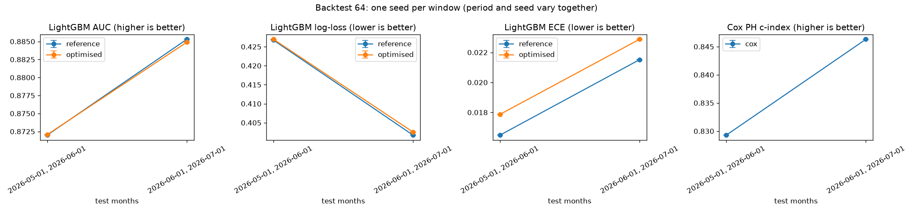

# Temporal Robustness (training spec, point 8), brandId 64

The optimisation is repeated on earlier windows of the monthly cutoffs of `data/processed/train_dataset_64_2025-09-01_2025-10-01_2025-11-01_2025-12-01_2026-01-01_2026-02-01_2026-03-01_2026-04-01_2026-05-01_2026-06-01_2026-07-01_2026-08-01_1791389367.parquet`: window k takes the first cutoffs up to its test months and splits them as in normal training (train = the earlier months, validation = the month before the test months, test = the last 2 months). Three models per window, trained exactly as in normal training: the **reference** LightGBM (optimisation step 1), the **optimised** LightGBM (every optimisation step) and Cox PH (with the optimised LightGBM's features). Seed mode **per_window**: each window has its own random seed (892, 7739); the seed changes the LightGBM row and column sampling and the Optuna search.

Backtest id `backtest_brand64_2026-08-01_2windows_1791389679` (2 windows, one seed each = 2 trainings per model, 8.6 min). Every run is in MLflow with the tags `backtest_id`, `scenario` and `seed`; the summary run (experiment `whizdom-churn-backtest`) has one chart per metric across windows.

## Results per window (test months; mean ± spread between seeds)

| # | test months | test rows | churn | AUC ref | AUC opt | log-loss ref | log-loss opt | ECE ref | ECE opt | C-index |
|---|---|---|---|---|---|---|---|---|---|---|
| 1 | 2026-05-01, 2026-06-01 | 25,805 | 36.9% | 0.8720 | 0.8721 | 0.4267 | 0.4270 | 0.0165 | 0.0179 | 0.8293 |
| 2 | 2026-06-01, 2026-07-01 | 23,445 | 34.3% | 0.8853 | 0.8849 | 0.4017 | 0.4025 | 0.0215 | 0.0229 | 0.8463 |

## Summary

Mean over the windows and its standard deviation. Each window has its own seed, so this spread mixes the change of period and the change of seed: if it is small, the model is robust to both. To tell them apart, run with `SEED_MODE=grid`.

| Metric | Reference: mean / ± between windows (period and seed) | Optimised: mean / ± between windows (period and seed) |
|---|---|---|
| LightGBM AUC | 0.8786 / ± 0.0094 | 0.8785 / ± 0.0091 |
| LightGBM log-loss | 0.4142 / ± 0.0177 | 0.4147 / ± 0.0173 |
| LightGBM ECE | 0.0190 / ± 0.0036 | 0.0204 / ± 0.0035 |
| Cox PH c-index | | 0.8378 / ± 0.0120 |

**Does the optimisation gain hold on every window?** No: averaged over the seeds, the optimised model has a higher or equal AUC in 1 of 2 windows (mean change -0.0002) and a lower or equal log-loss in 0 of 2 (mean change +0.0005). By the spec's rule (point 8), the simpler reference configuration is the safer choice until the gain holds on every window.

## How to read it

- A difference between two models smaller than the spread between seeds is luck, not a real difference; one smaller than the spread between periods may not hold next month.
- The windows are **not independent**: they share their earlier months, and the players repeat across cutoffs.
- The winsorisation caps come from the configuration of the main pipeline (they may have seen some test months' features, not their labels).

Generated by `src/models/robustness.py` (`make robustness`). Table (one row per scenario and seed): `data/03_output/backtest/backtest_brand64_2026-08-01_2windows_1791389679.csv`.
